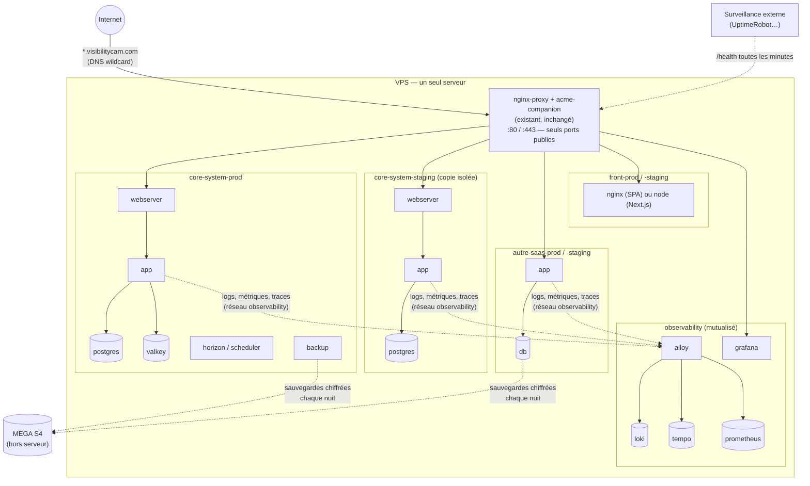
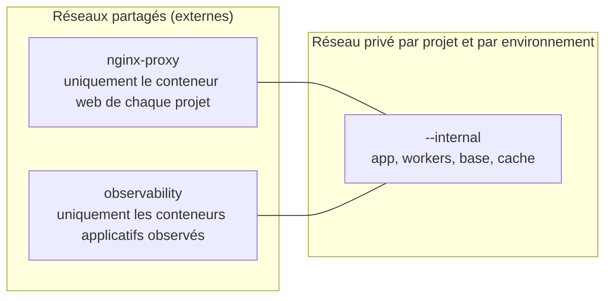
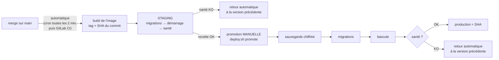

# Standard d'hébergement du VPS

Ce dépôt définit **comment tout projet est hébergé sur le VPS**, quel que soit son
langage (Laravel, Node, React, Angular, Next.js…). Une seule exigence : le projet
tourne dans Docker. En échange, il obtient automatiquement :
- HTTPS ;
- un staging ;
- un déploiement avec retour arrière ;
- des sauvegardes chiffrées hors du serveur ;
- une supervision (pour les backends) ;
- une protection contre les collisions de sous-domaines.

## Par où commencer ?

**Le référentiel est le [contrat d'un projet](docs/05-contrat-projet.md)** : ce que
tout projet hébergé doit respecter, qui le vérifie, et comment le faire évoluer.
Le reste de ce dépôt (modèles, outils, guides) l'applique.

| Je suis… | Je lis |
| --- | --- |
| **Responsable d'un projet déjà en production** à mettre au standard | [Contrat, § 4 : appliquer à un projet existant](docs/05-contrat-projet.md#4-appliquer-le-contrat-à-un-projet-déjà-en-production), puis `deploy.sh check prod` (lecture seule) |
| **Nouvelle équipe informatique** qui reprend le serveur | [Guide 15, prise en main](guides/15-prise-en-main-equipe-it.md), puis les [runbooks d'incident](docs/runbooks/README.md) |
| **Mainteneur de la plateforme** (je change une règle, un outil) | [Contrat, § 5 : faire évoluer le contrat](docs/05-contrat-projet.md#5-faire-évoluer-le-contrat) et les [retours d'expérience](docs/retours-experience/README.md) |
| **Développeur** et je veux mettre mon projet en ligne | [Démarrage rapide](docs/04-demarrage-rapide-dev.md), puis les [schémas](docs/01-schemas.md) |
| **Nouveau** et je veux comprendre comment le serveur fonctionne | [Schémas](docs/01-schemas.md) et [glossaire](docs/03-glossaire.md) |
| **La personne qui installe** la plateforme | la [feuille de route](guides/00-feuille-de-route.md) (qui fait quoi, dans quel ordre), puis les [guides](guides/README.md) |
| **Je veux savoir ce qui tourne sur le serveur** | `vps-inventory.sh`, et les [inventaires](docs/inventaire/README.md) déjà faits ; assisté par Claude Code : [guide 13](guides/13-intervention-assistee.md) |
| **Responsable technique** | ce document, [résilience et évolutivité](docs/02-resilience-evolutivite.md), [ADR-0064](docs/adr/0064-infrastructure-vps-staging-observabilite-mutualisee.md) |
| **En plein incident** | § 11 ci-dessous, puis la [reprise après sinistre](guides/12-reprise-apres-sinistre.md) si le serveur est perdu |

## Contenu du dépôt

| Dossier | Contenu |
| --- | --- |
| [`docs/`](docs) | **[Contrat d'un projet](docs/05-contrat-projet.md)** (le référentiel), [schémas de chaque élément](docs/01-schemas.md), [résilience et évolutivité](docs/02-resilience-evolutivite.md), [glossaire](docs/03-glossaire.md), [démarrage rapide](docs/04-demarrage-rapide-dev.md), [retours d'expérience](docs/retours-experience/README.md) |
| [`guides/`](guides/README.md) | **Guides pas à pas** de mise en place, dans l'ordre |
| [`bin/deploy.sh`](bin/deploy.sh) | Déploiement standard : build, staging automatique, promotion manuelle en production, retour arrière automatique. **Contrôle avant déploiement** (rien n'est modifié s'il échoue) : cohérence `platform.env` ↔ compose, noms en conflit sur les réseaux partagés, accès git, sous-domaine déjà pris, volume encore utilisé ailleurs. `deploy.sh check <env>` lance ce contrôle seul |
| [`bin/vps-audit.sh`](bin/vps-audit.sh) | Audit **en lecture seule** de tous les conteneurs du serveur, noms en conflit sur les réseaux partagés compris |
| [`bin/vps-inventory.sh`](bin/vps-inventory.sh) | **Inventaire** complet du serveur en Markdown (hôte, projets, dossiers, versions déployées, réseaux partagés, crons, audit), **sans aucun secret**, en lecture seule. Rangé dans [`docs/inventaire/`](docs/inventaire/README.md) |
| [`bin/vps-hosts.sh`](bin/vps-hosts.sh) | Inventaire de tous les sous-domaines, contrôle « libre ou pris ? », garde contre les collisions |
| [`bin/restore.sh`](bin/restore.sh) | Restauration d'une sauvegarde dans un environnement |
| [`templates/`](templates) | Modèles prêts à copier : Laravel, web générique, frontend (SPA et Next.js) ; [kit d'intervention assistée](templates/intervention-claude/PROMPT.md) (Claude Code avec garde-fous, guide 13) |
| [`images/db-backup/`](images/db-backup) | Agent de sauvegarde PostgreSQL / MySQL / MariaDB → MEGA S4 (ou tout S3) |
| [`observability/`](observability) | Grafana + Loki + Tempo + Prometheus mutualisés (backends) |
| [`host/`](host) | Réglages du démon Docker (rotation des journaux, live-restore) et procédure sans coupure |
| [`tests/`](tests/README.md) | Tests **réels** de toute la plateforme, rejouables sur un poste avec Docker, et lancés par la CI GitHub sur chaque pull request ([`.github/workflows/tests.yml`](.github/workflows/tests.yml)) : une modification de la plateforme ne se merge qu'avec la CI verte |

> **Où vit ce dossier.** Il est né dans le dépôt `core-system`, mais il concerne
> tout le serveur. Il peut vivre dans son propre dépôt (`vps-platform`), cloné sur
> le serveur dans `/app/vps-platform` (guide 11). Les exemples utilisent ce chemin.

---

## 1. Vue d'ensemble du serveur



### Réseaux Docker : qui peut parler à qui



- **Une base ou un cache ne quitte jamais le réseau privé de son projet.** Sur
  `nginx-proxy`, n'importe quel conteneur de n'importe quel projet pourrait s'y
  connecter.
- **Aucun projet ne publie de port** (`ports:`), sauf nginx-proxy (80/443). Docker
  écrit ses règles réseau **avant** le pare-feu ufw : un `ports: "5432:5432"` rend la
  base accessible depuis Internet même si ufw dit le contraire.
- **Les services d'un projet portent des noms uniques** (`mon-saas-web`,
  `mon-saas-db`, `mon-saas-redis`), jamais `app`, `db` ou `redis`. Le conteneur
  web est branché sur `nginx-proxy` et y voit les noms de **tous** les projets :
  si un autre y a laissé un `db`, Docker peut lui donner celui-là. Vécu au
  premier déploiement de skills-devops : migrations en `Connection refused`
  contre la base d'un autre projet. Les modèles de `templates/` appliquent la
  règle.

---

## 2. Le standard — 16 règles

Résumé du [contrat d'un projet](docs/05-contrat-projet.md), qui détaille chaque règle.
Colonne « Vérifié par » : un niveau d'audit (`vps-audit.sh`, lecture seule) ou
**BLOQUANT** (`deploy.sh` refuse avant de modifier quoi que ce soit).

| # | Règle | Pourquoi | Vérifié par |
| --- | --- | --- | --- |
| 1 | Tout passe par **nginx-proxy** (`VIRTUAL_HOST` + `LETSENCRYPT_HOST`), jamais `ports:` | HTTPS automatique ; rien d'autre n'est exposé | CRITIQUE |
| 2 | Base, cache, file : **réseau privé du projet uniquement** | Isolation entre projets | CRITIQUE |
| 3 | Pas de `privileged`, pas de socket Docker monté (sauf plateforme) | Monter le socket Docker donne les droits root sur tout le VPS | CRITIQUE |
| 4 | `restart: unless-stopped` partout | Les sites reviennent seuls après un redémarrage | ATTENTION |
| 5 | **Limite mémoire** sur chaque conteneur | Une fuite mémoire ne fait pas tomber les autres projets | ATTENTION |
| 6 | **Rotation des journaux** (`max-size`) | Un projet bavard ne remplit pas le disque de tout le monde | ATTENTION |
| 7 | **Healthcheck** sur le conteneur web | Le déploiement sait si la nouvelle version fonctionne | INFO |
| 8 | Images taguées par **commit** (`${IMAGE_TAG}`), jamais `latest` | Savoir ce qui tourne, revenir en arrière en une commande | INFO |
| 9 | **Staging et production** = même compose, fichier d'environnement différent | Staging teste exactement ce qui partira en production | — |
| 10 | Secrets dans `.env` / `.env.staging`, **jamais commités** ; staging n'a jamais les secrets de production | Une fuite de staging ne compromet pas la production | — |
| 11 | Toute base a sa **sauvegarde chiffrée hors serveur**, restaurée une fois par mois | Le VPS est un point unique de défaillance | — |
| 12 | Backends : **labels d'observabilité** | Journaux et erreurs de tous les projets au même endroit | INFO |
| 13 | **Noms de services propres au projet** (`<app>-web`, `<app>-db`, `<app>-redis`), jamais `app`, `db`, `redis` | Le conteneur web voit les noms de tous les projets sur `nginx-proxy` : un `db` étranger peut répondre à la place du vôtre | **BLOQUANT** en cas de conflit réel |
| 14 | Healthcheck de la base **par le réseau** (`pg_isready -h 127.0.0.1`) | Au premier démarrage, le socket local répond avant le réseau : migrations lancées trop tôt | Modèles |
| 15 | `platform.env` **commité**, cohérent avec le compose, **jamais modifié sur le serveur** | Il est relu dans le commit déployé | **BLOQUANT** |
| 16 | Le serveur lit le dépôt par sa **clé de déploiement SSH** (`github-<app>`), jamais en HTTPS | Sous cron, personne ne tape de mot de passe | **BLOQUANT** |

Règles 13 à 16 : ajoutées le 2026-10-04 après le
[premier déploiement de skills-devops](docs/retours-experience/2026-10-04-premier-deploiement-skills-devops.md).

---

## 3. Domaines et DNS

**Un enregistrement DNS wildcard suffit** : `*.visibilitycam.com A <IP du VPS>` (plus
`AAAA` si IPv6). Tout nouveau sous-domaine arrive alors sur le VPS. nginx-proxy le
route vers le conteneur qui porte ce `VIRTUAL_HOST`. acme-companion obtient tout seul
son certificat Let's Encrypt, au premier démarrage du conteneur.

- **Les enregistrements existants restent prioritaires** sur le wildcard : les sites
  déjà en ligne ne changent pas.
- Un sous-domaine qui n'est porté par aucun conteneur reçoit une erreur 503 de
  nginx-proxy, sans certificat émis.
- **Limite Let's Encrypt** : 50 nouveaux certificats par semaine pour le domaine. Elle
  ne gêne pas un usage normal, mais évitez de créer et supprimer des sous-domaines en
  boucle.

**Collisions** : nginx-proxy ne refuse jamais un nom déjà pris.
- Deux projets avec le même `VIRTUAL_HOST` : il répartit les visiteurs entre les
  deux.
- Le même nom avec une casse différente : sa configuration devient invalide, et plus
  aucun changement de site n'est appliqué sur tout le serveur.

La plateforme s'en protège :
- `bin/vps-hosts.sh` fait l'inventaire, répond « libre ou pris ? » et sert de garde ;
- `deploy.sh` refuse un nom déjà pris, et refuse aussi de déployer quand nginx-proxy
  est en erreur ;
- l'audit signale les deux cas en CRITIQUE.

Mode d'emploi : [guide 1](guides/01-inventaire-sous-domaines.md).

**Convention de nommage, des noms « plats » (un seul niveau) :**

| Environnement | Nom |
| --- | --- |
| Production | `<projet>.visibilitycam.com` |
| Staging | `<projet>-staging.visibilitycam.com` |
| Plateforme | `grafana.visibilitycam.com` |

Pourquoi un seul niveau : si le domaine passe un jour derrière Cloudflare, son
certificat gratuit ne couvre que `*.visibilitycam.com`, pas
`*.staging.visibilitycam.com`.

### Cloudflare ?

**Recommandation : utiliser Cloudflare seulement comme hébergeur DNS, proxy
désactivé (nuage gris), au moins au début.** C'est gratuit, le wildcard se crée en un
clic, et le comportement des sites existants ne change pas.

Activer le proxy Cloudflare (nuage orange) protège contre les attaques DDoS et cache
l'IP du serveur, mais modifie trois choses pour **tous** les projets proxifiés :

1. **Les applications voient l'IP de Cloudflare au lieu de celle du client.** Il faut
   restaurer la vraie IP dans nginx-proxy (`real_ip_header CF-Connecting-IP` depuis les
   plages Cloudflare). Le Core en dépend pour la liste d'IP autorisées de MyCoolPay.
2. **Les certificats** : passer en mode SSL « Full (strict) » ; garder acme-companion
   ou poser un certificat d'origine Cloudflare.
3. **Les webhooks entrants des providers** (MyCoolPay) passent aussi par Cloudflare.

À activer projet par projet, en activant le nuage orange sur l'enregistrement
explicite de ce projet, après avoir ajouté la restauration de l'IP. Jamais sur le
wildcard d'un coup.

---

## 4. Organisation sur le serveur

```
/app/
├── nginx-proxy-conf/          existant — inchangé
├── vps-platform/              clone de ce dépôt (vcam-infra-deploy)
│   └── observability/.env
├── core-system/
│   ├── prod/                  checkout git — .env              (promotion uniquement)
│   └── staging/               checkout git — .env.staging      (build + déploiement auto)
└── <autre-projet>/
    ├── prod/
    └── staging/
/var/lib/vps-platform/<projet>/   versions déployées (current, previous), journal des déploiements
```

Deux checkouts par projet. Celui de **staging** construit les images ; celui de
**production** ne construit jamais rien. Il récupère les fichiers du même commit
(`compose`, configuration nginx) et utilise **l'image déjà testée en staging**, qui se
trouve sur le même serveur. Aucun registre d'images n'est nécessaire.

---

## 5. Protocole de livraison



| Étape | Commande (depuis le checkout concerné) |
| --- | --- |
| Staging automatique | cron : `cd /app/<projet>/staging && /app/vps-platform/bin/deploy.sh watch` |
| Staging manuel, d'une branche précise | `deploy.sh build origin/ma-branche` puis `deploy.sh up staging <sha>` |
| Production | `cd /app/<projet>/prod && deploy.sh promote` (demande de taper « oui ») |
| Retour arrière | `deploy.sh rollback prod` (ou `staging`) |
| État | `deploy.sh status` |
| Restauration | `bin/restore.sh prod <fichier>` |

**Deux garanties :**
- **On ne livre en production que ce que le staging a validé**, octet pour octet.
  Exception : `BUILD_PER_ENV=1`, pour les frameworks qui figent leur configuration
  au build (Next.js et `NEXT_PUBLIC_*`). Les deux images viennent alors du même commit.
- **Une version qui ne répond pas à son healthcheck ne reste jamais en ligne.**

Limite à connaître : **les migrations ne sont pas annulées** par un retour arrière.
C'est pourquoi une sauvegarde est prise juste avant, et pourquoi les migrations
doivent rester compatibles avec la version précédente (ajouter une colonne avant de
l'utiliser, la supprimer une version plus tard).

### Staging automatique, maintenant puis avec GitLab

**Maintenant (sans CI)** : une ligne de cron sur le serveur, `crontab -e` en root.

```cron
*/2 * * * * cd /app/core-system/staging && /app/vps-platform/bin/deploy.sh watch >> /var/log/vps-deploy.log 2>&1
```

`watch` ne fait rien si `main` n'a pas bougé. Il ne réessaie pas en boucle un commit
dont le déploiement a échoué : il attend le commit suivant.

**Plus tard avec GitLab** : le runner déjà installé sur le serveur (exécuteur
`shell`) remplace le cron. On supprime alors la ligne cron.

```yaml
# .gitlab-ci.yml (extrait)
stages: [test, staging, production]

deploy_staging:
  stage: staging
  tags: [vps]                  # le runner du serveur
  rules: [{ if: '$CI_COMMIT_BRANCH == "main"' }]
  script:
    - cd /app/$CI_PROJECT_NAME/staging
    - /app/vps-platform/bin/deploy.sh build $CI_COMMIT_SHA
    - /app/vps-platform/bin/deploy.sh up staging $CI_COMMIT_SHA

deploy_production:
  stage: production
  tags: [vps]
  rules: [{ if: '$CI_COMMIT_BRANCH == "main"', when: manual }]   # bouton dans GitLab
  script:
    - cd /app/$CI_PROJECT_NAME/prod
    - /app/vps-platform/bin/deploy.sh promote $CI_COMMIT_SHA --yes
```

---

## 6. Brancher un nouveau projet (check-list)

1. **Modèle** : copier depuis `templates/` selon le type :
   - `compose.laravel.yaml` : Laravel avec queue, scheduler, base, cache et
     sauvegarde ;
   - `compose.web.yaml` : n'importe quel backend web ;
   - `frontend/` : SPA React/Angular/Vue (`Dockerfile.spa`) ou Next.js
     (`Dockerfile.nextjs`).

   Renommer en `compose.prod.yaml` et remplacer `mon-saas` par le nom du projet
   **partout**, noms de services compris (règle 13).
2. **`platform.env`** (commité) : nom, healthcheck, migrations, sauvegarde. Modèle :
   `templates/platform.env`, ou `templates/frontend/platform.env` pour un frontend.
3. **Fichiers d'environnement** (non commités) : `.env` et `.env.staging`, avec les
   variables de `templates/env.platform.example`. Les ajouter au `.gitignore`.
4. **Sur le serveur** :
   ```bash
   # clé de déploiement + alias SSH github-<projet> : guide 3, étape 0 (règle 16)
   mkdir -p /app/<projet> && cd /app/<projet>
   git clone git@github-<projet>:<compte>/<dépôt>.git staging
   git clone git@github-<projet>:<compte>/<dépôt>.git prod
   # déposer .env.staging dans staging/ et .env dans prod/
   cd staging && /app/vps-platform/bin/deploy.sh check staging   # aucun déploiement, lecture seule
   /app/vps-platform/bin/deploy.sh watch                         # premier staging
   cd ../prod && /app/vps-platform/bin/deploy.sh promote    # première production
   ```
5. Ajouter la ligne cron de staging automatique (§ 5).
6. Ajouter `https://<projet>.visibilitycam.com/<health>` à la surveillance externe.
7. Lancer `vps-audit.sh` : le projet ne doit avoir **aucune** ligne CRITIQUE ni
   ATTENTION.

---

## 7. Corriger un projet existant

1. **Lancer l'audit** (lecture seule, aucun effet sur les sites) :
   ```bash
   /app/vps-platform/bin/vps-audit.sh
   ```
2. **Corriger dans le compose du projet**, en commençant par les CRITIQUE :

| Constat de l'audit | Correction dans le compose |
| --- | --- |
| Port publié sur Internet / base publiée | Supprimer `ports:`. Pour un accès d'administration : `127.0.0.1:5432:5432`, puis tunnel SSH. Le web passe par `VIRTUAL_HOST` |
| Base sur le réseau `nginx-proxy` | Retirer la base de ce réseau. Seul le conteneur web y reste ; app et base partagent un réseau `<projet>-internal` |
| Socket Docker monté / `privileged` | Supprimer, sauf outil d'infrastructure assumé |
| Pas de politique de redémarrage | `restart: unless-stopped` |
| Aucune limite mémoire | `deploy.resources.limits.memory` (partir de 2× la consommation observée : `docker stats`) |
| Journaux sans rotation | Bloc `logging` des modèles, ou réglage global (§ 8) |
| `VIRTUAL_HOST` sans `LETSENCRYPT_HOST` | Ajouter `LETSENCRYPT_HOST` (même valeur) et `LETSENCRYPT_EMAIL` |
| `VIRTUAL_HOST` hérité sur un conteneur non exposé | La variable est dans un `env_file` partagé : la renommer (`APP_PUBLIC_HOST`) et ne mettre `VIRTUAL_HOST: ${APP_PUBLIC_HOST}` que sur le conteneur web |
| Image `latest` | `image: <projet>:${IMAGE_TAG:-latest}` + `deploy.sh` |
| Pas de healthcheck | Bloc `healthcheck` des modèles |
| `deploy.sh check` : nom « db » aussi publié sur nginx-proxy par … | Renommer le service (`<app>-db`) et `DB_HOST` ; procédure : [contrat, § 4](docs/05-contrat-projet.md#4-appliquer-le-contrat-à-un-projet-déjà-en-production) |
| `deploy.sh check` : `platform.env` cite un service absent | Aligner `HEALTH_SERVICE`/`MIGRATE_SERVICE`/`BACKUP_SERVICE`/`DB_SERVICE` sur le compose, dans le même commit |
| `deploy.sh check` : origin en HTTPS | `git remote set-url origin git@github-<app>:<compte>/<dépôt>.git` (guide 3) |

3. **Appliquer sans coupure inutile** : la correction prend effet quand le projet est
   recréé (`docker compose up -d`), donc au prochain déploiement. Les volumes de
   données ne sont pas touchés tant que le **nom du projet compose** ne change pas.
   Pour l'adopter, garder le nom actuel : c'est l'option `-p` utilisée par
   `deploy.sh`, `<APP_NAME>-prod`. Vérifier avec `docker compose ls` avant de choisir
   `APP_NAME`.
4. **Relancer l'audit.**

---

## 8. Réglages de l'hôte (une fois)

- **Rotation des journaux et live-restore pour tous les conteneurs** :
  `host/apply-daemon-config.sh`. Le script :
  1. fusionne avec la configuration existante, sans rien écraser ;
  2. la valide ;
  3. active live-restore **avant** de redémarrer Docker, pour que les conteneurs
     continuent de tourner pendant le redémarrage.

  À lancer de préférence en heure creuse : une interruption réseau de quelques
  secondes reste possible. La rotation s'applique aux conteneurs recréés ensuite.
- **Pare-feu** : `ufw` n'ouvre que 22, 80 et 443. Rappel : il ne protège pas les
  ports publiés par Docker (règle 1).
- **Mises à jour de sécurité automatiques** : `apt install unattended-upgrades`.
- **SSH** : connexion par clé uniquement (`PasswordAuthentication no`), `fail2ban`.
- **Nettoyage** : `docker image prune -f` hebdomadaire. `deploy.sh` garde déjà
  seulement les 5 dernières images de chaque projet.

---

## 9. Sauvegardes

L'agent [`images/db-backup`](images/db-backup/README.md) tourne dans chaque projet
qui a une base de données :
- dump chaque nuit, chiffré AES-256 avec une phrase de passe propre au projet ;
- 7 copies sur le serveur ;
- copie sur MEGA S4, gardée 30 jours.

`deploy.sh promote` en prend une juste avant les migrations, et **refuse de
déployer** si elle échoue.

**Test de restauration mensuel**, obligatoire pour qu'une sauvegarde compte :

```bash
# 1. télécharger la dernière sauvegarde de production depuis MEGA, puis :
docker cp <fichier>.dump.enc "$(docker ps -q -f label=com.docker.compose.project=<projet>-staging -f label=com.docker.compose.service=backup)":/backups/
# 2. restaurer dans le staging, avec la phrase de passe de PRODUCTION donnée
#    ponctuellement (jamais écrite dans .env.staging) :
cd /app/<projet>/staging
read -rs RESTORE_PASSPHRASE && export RESTORE_PASSPHRASE
/app/vps-platform/bin/restore.sh staging <fichier>.dump.enc
```

Cela restaure la production dans le staging. Attention aux données personnelles : le
staging contient alors des données réelles. Le réinitialiser ensuite si besoin.

---

## 10. Supervision

- **Backends** : brancher l'observabilité mutualisée ([`observability/README.md`](observability/README.md)).
  Journaux de tous les projets dans Grafana → *Applications*.
- **Frontends** : pas d'observabilité serveur. La surveillance externe suffit.
- **Surveillance externe (indispensable)** : un service gratuit hors du serveur
  (UptimeRobot, Better Stack) appelle chaque site de production toutes les minutes et
  alerte par e-mail ou SMS. Grafana tourne sur le même serveur : il ne peut pas
  prévenir si le serveur entier tombe.

---

## 11. Incidents — quoi faire

| Symptôme | Action |
| --- | --- |
| Un site ne répond plus après un déploiement | `deploy.sh rollback prod` dans son checkout prod |
| Un site ne répond plus sans déploiement | `deploy.sh status`, puis `docker compose -p <projet>-prod logs --tail 200 app` ; Grafana → Applications |
| Erreur 502 de nginx-proxy | Le conteneur web du projet est arrêté ou en échec : `docker ps -a \| grep <projet>` |
| Disque plein | `vps-audit.sh` (constats journaux), `docker system df`, `docker image prune -f`, `docker builder prune -f` |
| Données corrompues ou supprimées | `bin/restore.sh prod <sauvegarde>` (la dernière `pre-deploy-*` si c'est arrivé après un déploiement) |
| `deploy.sh` refuse avec « contrôle avant déploiement en échec » | Rien n'a été modifié. Lire les lignes au-dessus, corriger dans le dépôt, vérifier avec `deploy.sh check <env>`, pousser |
| `Connection refused` vers la base pendant les migrations, toujours la même adresse IP | Le nom de la base mène à un **autre** projet : `deploy.sh check <env>` le confirme ([REX](docs/retours-experience/2026-10-04-premier-deploiement-skills-devops.md)) |
| Tous les sites tombés | `systemctl status docker` ; `docker ps -a` ; redémarrer nginx-proxy en premier : `cd /app/nginx-proxy-conf && docker compose up -d` |
