# Schémas de la plateforme

Chaque schéma montre **un seul sujet**, avec en dessous ce qu'il faut en retenir.
Les mots techniques sont expliqués dans le [glossaire](03-glossaire.md).

Sommaire :
1. [Le serveur, vu d'en haut](#1-le-serveur-vu-den-haut)
2. [Qui peut parler à qui (réseaux)](#2-qui-peut-parler-à-qui-réseaux)
3. [Le trajet d'une visite](#3-le-trajet-dune-visite)
4. [Anatomie d'un projet](#4-anatomie-dun-projet)
5. [Du commit à la production](#5-du-commit-à-la-production)
6. [Ce que fait un déploiement, pas à pas](#6-ce-que-fait-un-déploiement-pas-à-pas)
7. [Sauvegardes et restauration](#7-sauvegardes-et-restauration)
8. [Observabilité : journaux, métriques, traces](#8-observabilité--journaux-métriques-traces)
9. [Un SaaS à sous-domaines automatiques](#9-un-saas-à-sous-domaines-automatiques)
10. [Les fichiers sur le serveur](#10-les-fichiers-sur-le-serveur)
11. [Les relations entre tous les éléments](#11-les-relations-entre-tous-les-éléments)

---

## 1. Le serveur, vu d'en haut

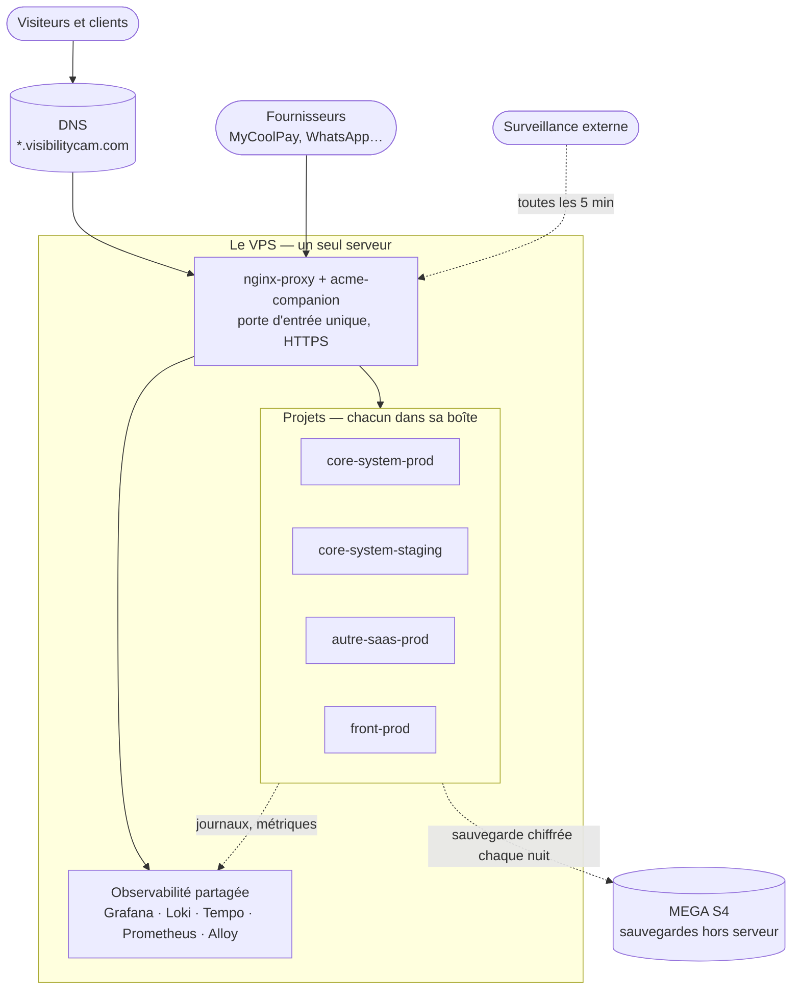

**À retenir**
- **Une seule porte d'entrée** : nginx-proxy, ports 80 et 443. Aucun projet n'ouvre
  de port sur Internet.
- **Deux sortes de choses** sur le serveur : les **services partagés**, installés une
  fois pour tous, et les **projets**, chacun dans sa boîte. Un projet en
  production et son staging sont deux boîtes séparées.
- Les sauvegardes partent **hors du serveur**. La surveillance vient **de
  l'extérieur**. Si le serveur meurt, on le sait, et on ne perd pas les données.

---

## 2. Qui peut parler à qui (réseaux)

Un **réseau Docker** est un câble virtuel : seuls les conteneurs branchés dessus
peuvent se joindre.

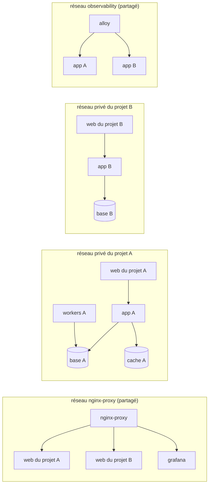

Un même conteneur peut être branché sur plusieurs réseaux. « web du projet A »
apparaît deux fois sur le schéma pour cette raison : il est à la fois sur
`nginx-proxy` et sur le réseau privé de son projet.

**À retenir**
- **Une base de données n'est branchée que sur le réseau privé de son projet.**
  Le projet B ne peut pas joindre la base A, même s'il est piraté.
- Sur `nginx-proxy`, seulement le conteneur **web** de chaque projet.
- Sur `observability`, seulement les conteneurs applicatifs qu'on veut observer.
  Jamais les bases.
- L'audit (`bin/vps-audit.sh`) vérifie ces règles.

---

## 3. Le trajet d'une visite

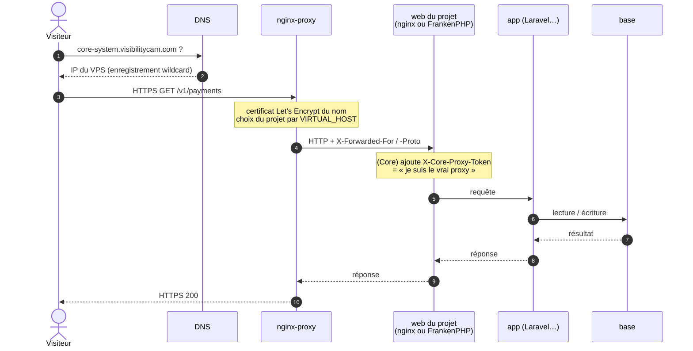

**À retenir**
- Le **nom** demandé (`Host`) décide du projet. D'où l'importance de ne jamais avoir
  deux projets qui déclarent le même nom (voir guide 1).
- Le HTTPS s'arrête à nginx-proxy. À l'intérieur du serveur, tout circule en HTTP sur
  des réseaux privés.
- L'app connaît la vraie IP du visiteur par `X-Forwarded-For`. Le Core n'y croit que
  si le jeton du sidecar est présent : un conteneur voisin ne peut pas se faire
  passer pour MyCoolPay.

---

## 4. Anatomie d'un projet

Ce que contient un projet au standard, ici un backend Laravel. Un frontend n'a que
le conteneur web.

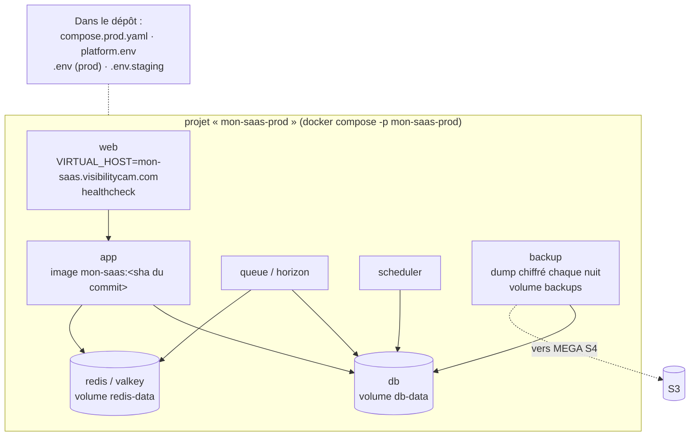

| Élément | Rôle | Règle |
| --- | --- | --- |
| `compose.prod.yaml` | Décrit les conteneurs. **Le même fichier** pour staging et production | modèle dans `templates/` |
| `platform.env` | Dit à `deploy.sh` comment déployer : nom, contrôle de santé, migrations, sauvegarde | commité |
| `.env` / `.env.staging` | Secrets et réglages de chaque environnement | **jamais commités** ; jamais les mêmes secrets en staging et en production |
| Image `<projet>:<sha>` | Le code figé d'un commit précis | construite une fois, en staging |
| Volumes | Les données (base, cache, sauvegardes locales) | survivent aux déploiements |
| Limites mémoire, rotation des journaux, healthcheck | Empêchent un projet de gêner les autres | vérifiés par l'audit |

---

## 5. Du commit à la production

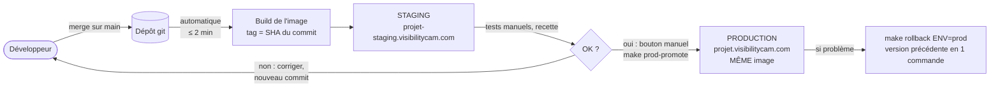

**À retenir**
- **On ne reconstruit jamais pour la production** : elle reçoit l'image exacte
  testée en staging.
- Le staging se met à jour **tout seul**. La production, **seulement à la main**.
- Revenir en arrière est **une commande**.

---

## 6. Ce que fait un déploiement, pas à pas

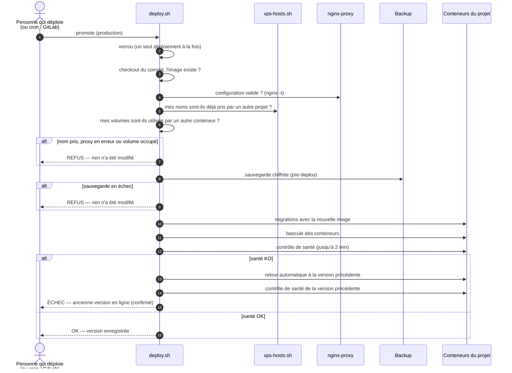

**À retenir**
- Tout ce qui peut échouer **avant** la bascule (nom pris, proxy cassé, volume
  encore utilisé par une ancienne installation, sauvegarde ratée, migration ratée)
  laisse la production **intacte**.
- Après la bascule, si l'application ne répond pas, **retour automatique**.
- Seule limite : une migration déjà appliquée n'est pas annulée. D'où la sauvegarde
  prise juste avant.

---

## 7. Sauvegardes et restauration

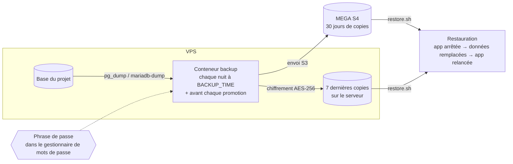

**À retenir**
- MEGA ne voit **que des données chiffrées**.
- **Sans la phrase de passe, aucune restauration n'est possible.** Elle doit être
  conservée hors du serveur.
- Une sauvegarde ne compte que si l'on a déjà réussi à la restaurer : une fois par
  mois, restaurer la production dans le staging (`README.md` § 9).

---

## 8. Observabilité : journaux, métriques, traces

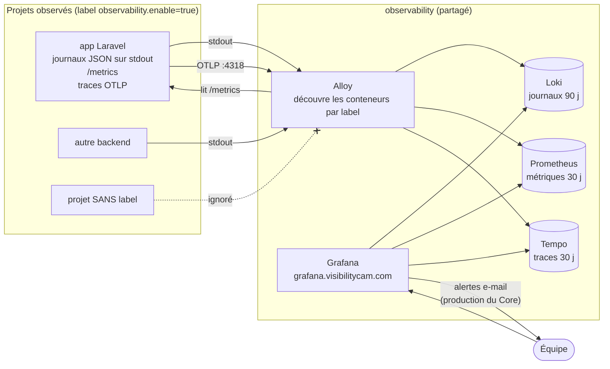

**À retenir**
- **Rien n'est collecté sans le label** `observability.enable=true`.
- Le minimum pour un projet Laravel : des journaux JSON sur la sortie standard,
  plus deux labels. Les métriques et les traces sont un bonus.
- Les frontends n'en ont pas besoin.

---

## 9. Un SaaS à sous-domaines automatiques

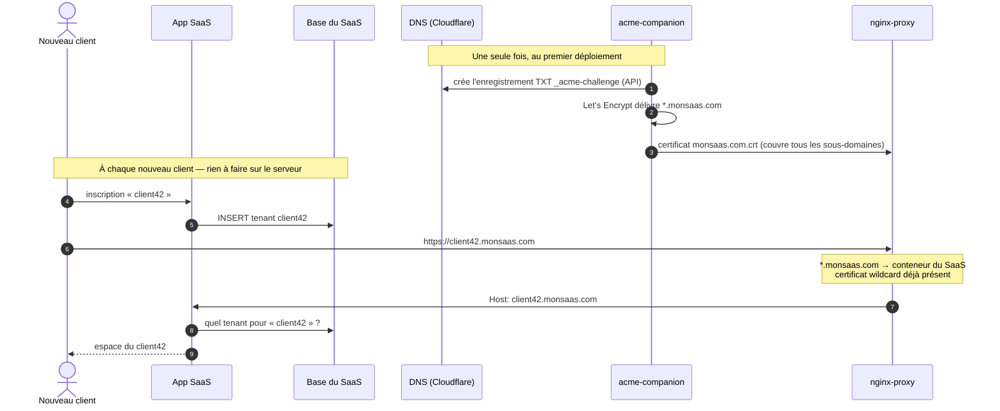

**À retenir**
- Le DNS wildcard et le certificat wildcard couvrent **tous** les clients, présents
  et futurs.
- **Créer un client = une ligne en base.** Aucune action sur le serveur.
- Détails et configuration : [guide 10](../guides/10-sous-domaines-automatiques.md).

---

## 10. Les fichiers sur le serveur

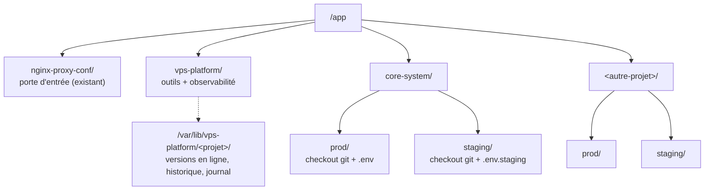

| Où | Quoi | Qui y touche |
| --- | --- | --- |
| `/app/nginx-proxy-conf` | Le proxy partagé | personne (sauf incident) |
| `/app/vps-platform` | Outils et observabilité | mise à jour par `git pull` |
| `/app/<projet>/staging` | Le checkout qui **construit** les images | `deploy.sh` (automatique) |
| `/app/<projet>/prod` | Le checkout de **production** : ne construit jamais | `make prod-promote` |
| `/var/lib/vps-platform` | La mémoire des déploiements (`current`, `previous`, journal) | `deploy.sh` |

---

## 11. Les relations entre tous les éléments

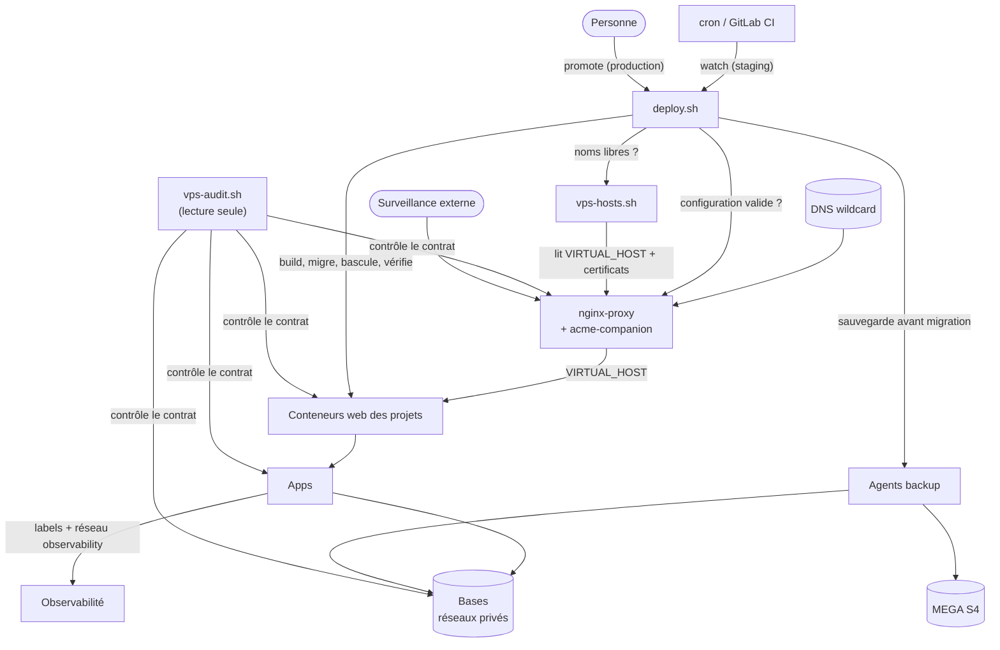

| Élément | Dépend de | Si il tombe… |
| --- | --- | --- |
| nginx-proxy | DNS, Docker | plus aucun site ne répond. Priorité absolue (guide 12) |
| acme-companion | nginx-proxy, DNS | les sites restent servis ; les renouvellements sont en retard (les certificats durent 90 jours) |
| Un projet | nginx-proxy, sa base | seul ce projet est touché |
| Observabilité | Docker | aucun site n'est touché ; on perd juste la visibilité |
| `deploy.sh` / cron | git, Docker | rien ne casse ; les déploiements attendent |
| MEGA S4 | Internet | rien ne casse ; les sauvegardes restent locales, à rattraper |
