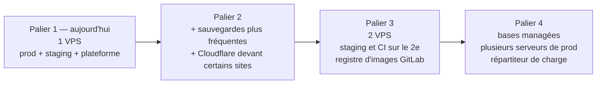

# Résilience et évolutivité

## 1. Résilience : ce qui peut tomber, et ce qui se passe alors

Un seul serveur ne peut pas être « haute disponibilité » : s'il s'éteint, tout
s'éteint. La plateforme vise donc trois choses :

1. une panne **locale** reste locale ;
2. une erreur humaine se **rattrape en une commande** ;
3. une perte totale du serveur se **reconstruit** sans perte de données au-delà de
   la dernière nuit.

| Panne | Ce qui l'arrête ou la rattrape | Effet pour les visiteurs | Testé |
| --- | --- | --- | --- |
| Un conteneur plante | `restart: unless-stopped` le relance | quelques secondes d'erreur sur ce projet | règle de l'audit |
| Fuite mémoire d'une app | limite mémoire : seul ce conteneur redémarre, pas le serveur | quelques secondes sur ce projet | règle de l'audit |
| Journaux qui remplissent le disque | rotation (20 Mo × 5 par conteneur) ; l'audit alerte à 70 % et 85 % | aucun | `test-hosts`, audit |
| Version cassée déployée | contrôle de santé + retour automatique | aucun en staging ; < 2 min en production | `test-deploy` |
| Mauvaise version en production, vue après coup | `make rollback ENV=prod` | une commande | `test-deploy` |
| Migration qui abîme les données | sauvegarde automatique juste avant + `restore.sh` | temps de restauration | `test-backup` |
| Deux projets sur le même sous-domaine | `deploy.sh` refuse, l'audit alerte | aucun (le déploiement fautif est bloqué) | `test-hosts`, `test-deploy` |
| Deux bases sur les mêmes données (ancienne installation encore démarrée lors d'une migration) | `deploy.sh` refuse tant qu'un conteneur étranger utilise un volume du projet | aucun (le déploiement est bloqué, rien n'est créé) | `test-deploy` |
| Configuration de nginx-proxy invalide | `deploy.sh` refuse de déployer dans cet état ; l'audit alerte | les sites existants tiennent ; aucun nouveau site tant que ce n'est pas corrigé | `test-hosts`, `test-deploy` |
| Projet compromis (piraté) | réseaux privés : il n'atteint ni les bases ni les autres apps ; pas de socket Docker | limité à ce projet | `test-platform` |
| Faux en-tête d'IP d'un conteneur voisin | jeton du sidecar (Core) | aucun | `test-platform` |
| Base de données corrompue | sauvegarde de la nuit (7 locales + 30 jours sur MEGA) | perte maximale : les données depuis la dernière sauvegarde | `test-backup` |
| Redémarrage du démon Docker | `live-restore` : les conteneurs continuent | aucun à quelques secondes | guide 9 |
| Certificat qui expire | acme-companion renouvelle 30 jours avant la fin ; la surveillance externe alerte | aucun | guide 8 |
| Serveur entièrement perdu | [guide 12 : reprise après sinistre](../guides/12-reprise-apres-sinistre.md) | quelques heures (réinstallation et restauration) | procédure |

**Les deux chiffres à connaître :**
- **Perte de données maximale** (RPO) : 24 h, l'intervalle entre deux sauvegardes.
  Pour la réduire, avancer `BACKUP_TIME` ou ajouter des sauvegardes intermédiaires
  (voir 2.2).
- **Temps de remise en service après perte du serveur** (RTO) : de l'ordre de 2 à
  4 heures, avec le guide 12 et les sauvegardes MEGA.

## 2. Évolutivité : grandir par paliers

Rien n'oblige à tout changer d'un coup. Chaque palier réutilise ce qui existe.

### 2.1 Ajouter un projet (n'importe quand)

Copier un modèle de `infra/templates/`, choisir un nom libre (`vps-hosts.sh
--free`), ajouter la ligne cron. **Aucune modification** de la plateforme ni des
autres projets. Check-list : `infra/README.md` § 6.

### 2.2 Palier 2 — sans nouveau serveur

| Besoin | Comment |
| --- | --- |
| Perdre moins de données | Plusieurs sauvegardes par jour : un second conteneur `backup` avec un autre `BACKUP_TIME`. Pour une perte quasi nulle, l'archivage continu PostgreSQL (WAL) est à étudier |
| Protection anti-DDoS, cacher l'IP | Cloudflare en mode proxy, projet par projet (`infra/README.md` § 3) |
| Plus de mémoire pour un projet | Monter ses limites dans son `.env` (`APP_MEMORY`…), puis redéployer |
| Serveur trop petit | Agrandir le VPS chez l'hébergeur : rien à changer dans la plateforme |

### 2.3 Palier 3 — un deuxième serveur

Quand la recette et les builds gênent la production :
- **Serveur 2** : staging de tous les projets et runner GitLab. Mêmes outils
  (`deploy.sh`, `vps-hosts.sh`, observabilité).
- **Registre d'images** : le registre GitLab, inclus. `deploy.sh build` pousse
  l'image, la production la tire. C'est le seul ajout au script : un `docker push` et
  un `docker pull`. Le reste ne change pas.
- **Observabilité** : une instance par serveur, ou une seule qui reçoit les deux.
  Alloy sait envoyer à distance.

### 2.4 Palier 4 — haute disponibilité

Plusieurs serveurs de production derrière un répartiteur, bases managées
(PostgreSQL/MySQL chez un hébergeur, avec réplication), stockage de fichiers en S3.
C'est un changement d'architecture : il fera l'objet d'une décision dédiée le jour
où le besoin sera réel.

**Ce qui est déjà prêt pour ce jour-là** :
- images immuables taguées par commit ;
- configuration par variables d'environnement ;
- applications sans état local, avec sessions et cache dans Valkey/Redis ;
- contrôles de santé ;
- sauvegardes dans S3.

## 3. Pourquoi ces choix

| Choix | Alternative écartée | Raison |
| --- | --- | --- |
| Garder nginx-proxy | Traefik, Caddy | Déjà en place pour tous les projets. Le remplacer ferait courir un risque à tous, pour un gain faible |
| Scripts bash + Docker Compose | Kubernetes, Coolify, Dokku | Un seul serveur : Kubernetes serait trop lourd. Les PaaS imposent leur façon de faire et cachent ce qui se passe. Les scripts sont lisibles, testés et s'arrêtent dès qu'il y a un doute |
| Images construites sur le serveur | Registre d'images | Un seul serveur : un registre n'apporte rien aujourd'hui. Il s'ajoute au palier 3 |
| Une stack d'observabilité partagée | Une par projet | Environ 1,5 Go de RAM une seule fois, au lieu d'autant par projet |
| Sauvegarde dans chaque projet | Un agent central qui lit toutes les bases | Chaque projet garde ses accès ; aucun conteneur n'a la clé de toutes les bases |
