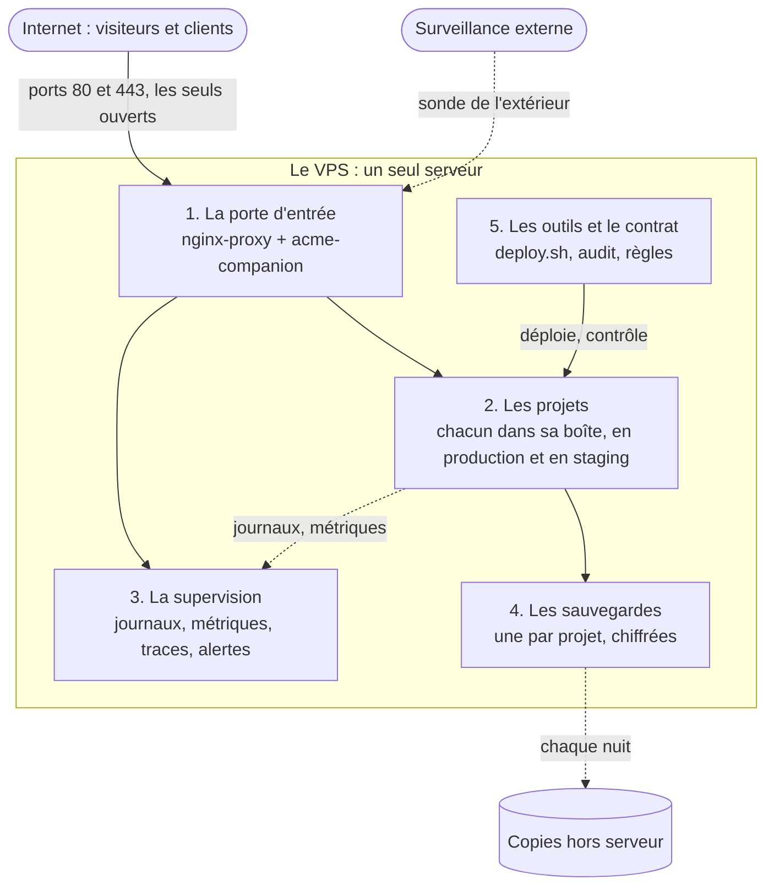
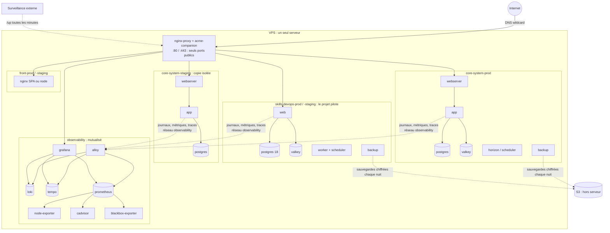
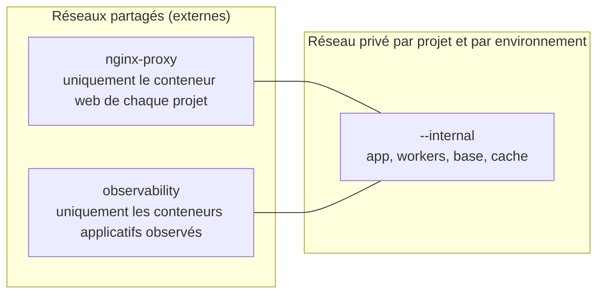

# Architecture du serveur

> **Le point d'entrée pour comprendre le serveur.** On y va du plus simple au plus détaillé, en trois niveaux : à chaque niveau, on sait où aller
> pour descendre d'un cran. Retour au [sommaire de la documentation](../README.md).

## Comment ne pas se perdre : trois niveaux

| Niveau | Question | Où |
| --- | --- | --- |
| **1. Le serveur en une image** | Qu'y a-t-il, et qui parle à qui, en gros ? | Cette page, § 1 |
| **2. Les cinq familles** | De quoi est faite la plateforme, et qui s'en occupe ? | Cette page, § 2 et § 3 |
| **3. Le détail d'un sujet** | Comment marche exactement X (déploiement, sauvegarde, alertes…) ? | [Schémas](../01-schemas.md) (un sujet par schéma), puis les pages de référence et les guides |

Les mots techniques : [glossaire](../03-glossaire.md). Une règle à respecter : [les 16 règles](les-16-regles.md).

## 1. Niveau 1 : le serveur en une image

**Une seule porte, deux sortes de choses.** Tout ce qui est public passe par `nginx-proxy`. Sur le serveur, il y a les **services partagés**
(porte d'entrée, supervision), installés une fois pour tous, et les **projets**, chacun isolé des autres.

## 2. Niveau 2 : les cinq familles

| Famille | Rôle | Ce qui la compose | Qui y touche | Pour le détail |
| --- | --- | --- | --- | --- |
| **1. La porte d'entrée** | Recevoir les visites, fournir le HTTPS, router vers le bon projet | `nginx-proxy`, `acme-companion` | personne, sauf incident | [Schéma 3](../01-schemas.md#3-le-trajet-dune-visite), [DNS](domaines-et-dns.md) |
| **2. Les projets** | Le travail de l'entreprise | Pour chaque projet et environnement : un web, une app, une base, un cache, des workers, un agent de sauvegarde | l'équipe du projet | [Schéma 4](../01-schemas.md#4-anatomie-dun-projet), [contrat](../05-contrat-projet.md) |
| **3. La supervision** | Voir ce qui se passe et prévenir | Alloy, Loki, Prometheus, Tempo, Grafana ; node-exporter, cAdvisor, blackbox-exporter | le responsable de la plateforme | [Schéma 8](../01-schemas.md#8-observabilité--journaux-métriques-traces), [carte complète](observabilite-carte-complete.md) |
| **4. Les sauvegardes** | Pouvoir revenir en arrière | Un agent par projet, des copies chiffrées sur le serveur et hors serveur | l'équipe du projet | [Schéma 7](../01-schemas.md#7-sauvegardes-et-restauration), [sauvegardes](sauvegardes.md) |
| **5. Les outils et le contrat** | Faire de la même façon pour tous | `deploy.sh`, `vps-audit.sh`, `vps-inventory.sh`, `restore.sh`, les modèles | le responsable de la plateforme | [Schéma 5](../01-schemas.md#5-du-commit-à-la-production), [organisation et livraison](organisation-et-livraison.md) |

Si **une famille tombe**, voici ce qu'on perd : la porte d'entrée, **tous les sites** ; un projet, **ce projet seul** ; la supervision,
**la visibilité seulement** ; les sauvegardes, **la possibilité de revenir en arrière** ; les outils, **la possibilité de déployer**
(rien ne casse). Le tableau complet est au [schéma 11](../01-schemas.md#11-les-relations-entre-tous-les-éléments).

## 3. Niveau 2 bis : le serveur en détail

Les mêmes cinq familles, avec les conteneurs réels.

## 4. Où trouver chaque chose dans le dépôt

| Famille | Dossier du dépôt | Ce qu'on y trouve |
| --- | --- | --- |
| Porte d'entrée | [`guides/`](../../guides/README.md) (installation) | Les guides d'installation du proxy et du DNS |
| Projets | [`templates/`](../../templates), [`docs/05-contrat-projet.md`](../05-contrat-projet.md) | Les modèles à copier, le contrat à respecter |
| Supervision | [`observability/`](../../observability/README.md) | La pile (`compose.yaml`), la configuration d'Alloy, de Prometheus, de Grafana (alertes et tableaux fournis comme du code) |
| Sauvegardes | [`images/db-backup/`](../../images/db-backup/README.md) | L'image de l'agent (sauvegarde, envoi S3, restauration) |
| Outils | [`bin/`](../../bin) | `deploy.sh`, `restore.sh`, `vps-audit.sh`, `vps-inventory.sh`, `vps-hosts.sh` |
| Qualité | [`tests/`](../../tests/README.md) | Un test par outil, rejoué avant chaque publication |
| Mémoire | [`docs/adr/`](../adr/README.md), [`docs/retours-experience/`](../retours-experience/README.md), [`docs/runbooks/`](../runbooks/README.md) | Pourquoi ce choix, ce qui a mal tourné, quoi faire en cas d'incident |

Et **sur le serveur** : [schéma 10](../01-schemas.md#10-les-fichiers-sur-le-serveur).

## Réseaux Docker : qui peut parler à qui

- **Une base ou un cache ne quitte jamais le réseau privé de son projet.** Sur
  `nginx-proxy`, n'importe quel conteneur de n'importe quel projet pourrait s'y
  connecter.
- **Aucun projet ne publie de port** (`ports:`), sauf nginx-proxy (80/443). Docker
  écrit ses règles réseau **avant** le pare-feu ufw : un `ports: "5432:5432"` rend la
  base accessible depuis Internet même si ufw dit le contraire.
- **Les services d'un projet portent des noms uniques** (`mon-saas-web`,
  `mon-saas-db`, `mon-saas-redis`), jamais `app`, `db` ou `redis`. Le conteneur
  web est branché sur `nginx-proxy` et y voit les noms de **tous** les projets :
  si un autre y a laissé un `db`, Docker peut lui donner celui-là. Vécu au
  premier déploiement de skills-devops : migrations en `Connection refused`
  contre la base d'un autre projet. Les modèles de `templates/` appliquent la
  règle.
