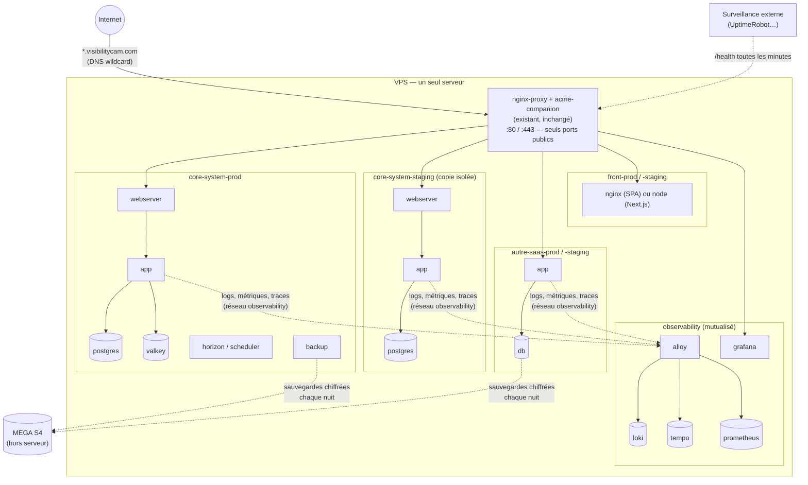
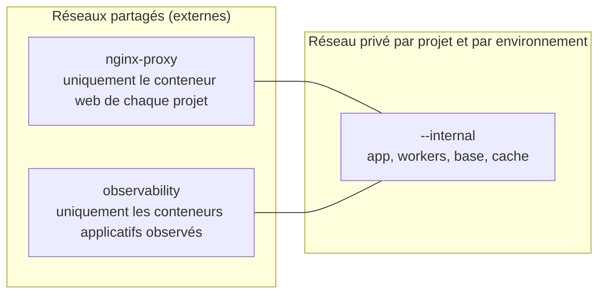

# Architecture du serveur

> Vue d'ensemble du VPS : les projets, `nginx-proxy`, les réseaux Docker et qui peut parler à qui.
> Retour au [sommaire de la documentation](../README.md).

## Réseaux Docker : qui peut parler à qui

- **Une base ou un cache ne quitte jamais le réseau privé de son projet.** Sur
  `nginx-proxy`, n'importe quel conteneur de n'importe quel projet pourrait s'y
  connecter.
- **Aucun projet ne publie de port** (`ports:`), sauf nginx-proxy (80/443). Docker
  écrit ses règles réseau **avant** le pare-feu ufw : un `ports: "5432:5432"` rend la
  base accessible depuis Internet même si ufw dit le contraire.
- **Les services d'un projet portent des noms uniques** (`mon-saas-web`,
  `mon-saas-db`, `mon-saas-redis`), jamais `app`, `db` ou `redis`. Le conteneur
  web est branché sur `nginx-proxy` et y voit les noms de **tous** les projets :
  si un autre y a laissé un `db`, Docker peut lui donner celui-là. Vécu au
  premier déploiement de skills-devops : migrations en `Connection refused`
  contre la base d'un autre projet. Les modèles de `templates/` appliquent la
  règle.
