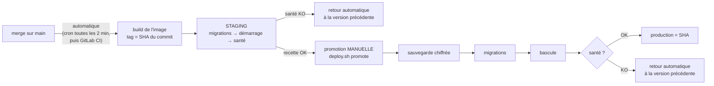

# Organisation sur le serveur et protocole de livraison

> Où se trouve chaque chose sur le serveur, et comment une version arrive du développement à la production.
> Retour au [sommaire de la documentation](../README.md).

> **Une situation précise (nouveau projet, variable, migration, retour arrière…) ?** [Déployer selon la situation](deployer-selon-la-situation.md).
>
> **Ce protocole décrit le profil standard (staging puis production).** Un projet peut n'avoir **pas de staging**, ou **plusieurs productions** :
> voir les [profils de projet](profils-de-projet.md). Dans tous les cas, une production n'est jamais déployée automatiquement.

## Organisation sur le serveur

```
/app/
├── nginx-proxy-conf/          existant — inchangé
├── vps-platform/              clone de ce dépôt (vcam-infra-deploy)
│   └── observability/.env
├── core-system/
│   ├── prod/                  checkout git — .env              (promotion uniquement)
│   └── staging/               checkout git — .env.staging      (build + déploiement auto)
└── <autre-projet>/
    ├── prod/
    └── staging/
/var/lib/vps-platform/<projet>/   versions déployées (current, previous), journal des déploiements
```

Deux checkouts par projet. Celui de **staging** construit les images ; celui de
**production** ne construit jamais rien. Il récupère les fichiers du même commit
(`compose`, configuration nginx) et utilise **l'image déjà testée en staging**, qui se
trouve sur le même serveur. Aucun registre d'images n'est nécessaire.

## Protocole de livraison



| Étape | Commande (depuis le checkout concerné) |
| --- | --- |
| Staging automatique | cron : `cd /app/<projet>/staging && /app/vps-platform/bin/deploy.sh watch` |
| Staging manuel, d'une branche précise | `deploy.sh build origin/ma-branche` puis `deploy.sh up staging <sha>` |
| Production | `cd /app/<projet>/prod && deploy.sh promote` (demande de taper « oui ») |
| Retour arrière | `deploy.sh rollback prod` (ou `staging`) |
| État | `deploy.sh status` |
| Restauration | `bin/restore.sh prod <fichier>` |

**Deux garanties :**
- **On ne livre en production que ce que le staging a validé**, octet pour octet.
  Exception : `BUILD_PER_ENV=1`, pour les frameworks qui figent leur configuration
  au build (Next.js et `NEXT_PUBLIC_*`). Les deux images viennent alors du même commit.
- **Une version qui ne répond pas à son healthcheck ne reste jamais en ligne.**

Limite à connaître : **les migrations ne sont pas annulées** par un retour arrière.
C'est pourquoi une sauvegarde est prise juste avant, et pourquoi les migrations
doivent rester compatibles avec la version précédente (ajouter une colonne avant de
l'utiliser, la supprimer une version plus tard).

### Staging automatique, maintenant puis avec GitLab

**Maintenant (sans CI)** : une ligne de cron sur le serveur, `crontab -e` en root.

```cron
*/2 * * * * cd /app/core-system/staging && /app/vps-platform/bin/deploy.sh watch >> /var/log/vps-deploy.log 2>&1
```

`watch` ne fait rien si `main` n'a pas bougé. Il ne réessaie pas en boucle un commit
dont le déploiement a échoué : il attend le commit suivant.

**Plus tard avec GitLab** : le runner déjà installé sur le serveur (exécuteur
`shell`) remplace le cron. On supprime alors la ligne cron.

```yaml
# .gitlab-ci.yml (extrait)
stages: [test, staging, production]

deploy_staging:
  stage: staging
  tags: [vps]                  # le runner du serveur
  rules: [{ if: '$CI_COMMIT_BRANCH == "main"' }]
  script:
    - cd /app/$CI_PROJECT_NAME/staging
    - /app/vps-platform/bin/deploy.sh build $CI_COMMIT_SHA
    - /app/vps-platform/bin/deploy.sh up staging $CI_COMMIT_SHA

deploy_production:
  stage: production
  tags: [vps]
  rules: [{ if: '$CI_COMMIT_BRANCH == "main"', when: manual }]   # bouton dans GitLab
  script:
    - cd /app/$CI_PROJECT_NAME/prod
    - /app/vps-platform/bin/deploy.sh promote $CI_COMMIT_SHA --yes
```
