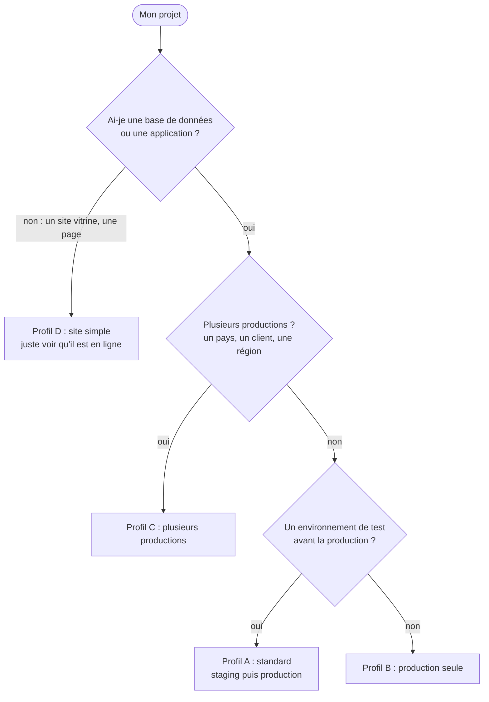
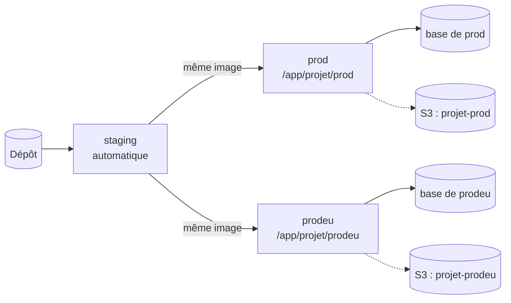

# Profils de projet : tous les projets ne sont pas faits pareil

> Un projet n'a pas forcément de staging, certains ont **plusieurs productions**, et un simple site web n'a pas besoin de toute la supervision.
> Cette page dit **quel profil choisir**, ce qu'il demande, et ce qui **ne change jamais**.
> Règle correspondante : [contrat, C11, C12 et C13](../05-contrat-projet.md). Retour au [sommaire](../README.md).

## 1. Quel profil est le mien ?



| Profil | Environnements | Pour qui | Ce qu'on gagne | Ce qu'on perd ou doit compenser |
| --- | --- | --- | --- | --- |
| **A. Standard** | `staging` puis `prod` | La plupart des applications | La production reçoit **exactement** l'image testée en staging | Rien |
| **B. Production seule** | `prod` | Un petit outil interne, un projet qui n'a pas les moyens d'un second environnement | Moins de choses à maintenir | **Aucun essai grandeur nature avant la production** : on compense (voir § 3) |
| **C. Plusieurs productions** | `staging` (facultatif) et plusieurs productions : `prod`, `prodeu`… | Un même logiciel déployé pour plusieurs clients ou régions, avec leurs propres données | Chaque production est **indépendante** : version, base, secrets, domaine | Plus de choses à promouvoir : une commande par production |
| **D. Site simple** | `prod` | Un site vitrine, une page statique, un site sans base de données | Presque rien à maintenir | Pas de sauvegarde ni de supervision détaillée : **juste la disponibilité** |

## 2. Ce qui ne change jamais, quel que soit le profil

| Règle | Pourquoi |
| --- | --- |
| Une production **n'est jamais déployée automatiquement** : c'est toujours une décision humaine (`deploy.sh promote`) | Une erreur ne doit jamais atteindre les clients toute seule |
| Une sauvegarde est faite **avant** chaque déploiement d'une production qui a une base, et le déploiement est **refusé** si elle échoue | Pouvoir revenir en arrière après une migration |
| **Le retour arrière** est automatique si la nouvelle version ne répond pas | Un déploiement raté ne coupe pas le site |
| Chaque production a **ses propres secrets** (jamais ceux d'un autre environnement) | Une fuite n'en compromet pas une autre ([clause C10](../05-contrat-projet.md)) |
| Aucun port publié, un nom propre à chaque service, aucun projet ne rejoint le réseau d'un autre ([clauses C1 à C3](../05-contrat-projet.md)) | Les projets du serveur restent isolés |
| Tout site public figure dans la **liste des sites sondés** (disponibilité et certificat) | On est prévenu avant le client |
| Les sauvegardes vivent **sur S3**, jamais sur le disque du serveur | [Sauvegardes](sauvegardes.md) |

## 3. Profil B : production seule

```
# platform.env
ENVIRONMENTS=prod
```

| Question | Réponse |
| --- | --- |
| Comment déployer ? | `cd /app/<projet>/prod && deploy.sh promote origin/main` : l'image est **construite sur place**, puis sauvegarde, migrations, santé |
| Et `watch` (le déploiement automatique) ? | Refusé : « ce projet n'a que des productions ». Il n'y a rien à déployer automatiquement |
| Et le retour arrière ? | `deploy.sh rollback prod` ; automatique si la santé échoue |
| Comment limiter le risque sans staging ? | 1. **Tests automatiques** dans le dépôt avant de pousser. 2. `deploy.sh check` avant chaque promotion (il ne change rien). 3. Déployer **hors des heures d'activité**. 4. Faire **réellement** l'[exercice de restauration](../runbooks/exercice-de-restauration.md) : la sauvegarde avant migration est votre seul filet |
| Quand passer au profil A ? | Dès que le projet a des utilisateurs qu'on ne veut pas surprendre : un second environnement coûte peu |

## 4. Profil C : plusieurs productions

```
# platform.env
ENVIRONMENTS="staging prod prodeu"
PROD_ENVIRONMENTS="prod prodeu"
```



| Sujet | Règle |
| --- | --- |
| **Noms d'environnements** | Lettres minuscules et chiffres seulement (`prod`, `prodeu`, `prod2`). Pas de tiret ni de majuscule : ces noms servent à nommer les projets Docker, les images et les variables. Un nom invalide est refusé avec une explication |
| **Un dossier par production** | `/app/<projet>/prod`, `/app/<projet>/prodeu`, chacun avec son `.env` (`.env` pour `prod`, `.env.<nom>` pour les autres) |
| **Promouvoir** | `deploy.sh promote --env prodeu` (sans `--env`, l'outil **refuse** de choisir à votre place : « plusieurs productions, préciser laquelle ») |
| **Versions** | Indépendantes : `prod` peut être en `v2` et `prodeu` en `v1`. Chaque production a sa version courante et sa précédente (`deploy.sh status` les liste) |
| **Image** | La même qu'en staging : construite une fois, promue deux fois |
| **Domaines** | Un nom par production : deux productions ne peuvent pas porter le même (`deploy.sh` le bloque) |
| **Secrets** | **Distincts** à chaque production (clause C10) |
| **Sauvegardes** | Un nom par production (`BACKUP_NAME: <projet>-${DEPLOYMENT}`) : chacune a **son dossier sur S3** et sa phrase de passe |
| **Observabilité** | `DEPLOYMENT=prodeu` dans son `.env` : le label `observability.deployment` distingue les productions dans Grafana |
| **Restauration** | Se fait **par production** : `restore.sh prodeu …` |

## 5. Profil D : site simple

Un site vitrine ou une page statique : **pas de base, pas de file, pas de secret métier**. On ne lui demande que l'essentiel.

| Besoin | Ce qu'on fait | Ce qu'on ne fait **pas** |
| --- | --- | --- |
| Être en ligne en HTTPS | Le [modèle web](../../templates/compose.web.yaml) (ou le modèle frontend) : `VIRTUAL_HOST`, `LETSENCRYPT_HOST`, aucun port publié | |
| Savoir qu'il est en ligne | **L'ajouter à la liste des sites sondés** (`sites.yml`, par le responsable de la plateforme) : alerte si le site ne répond plus, alerte 14 jours avant l'expiration du certificat | Pas de labels `observability.*`, pas de `/metrics` |
| Se déployer | `deploy.sh` (profil B, ou A si l'on veut une préproduction) | |
| Sauvegarde | **Aucune** : il n'y a pas de base. Le code est dans git | Pas de service `backup` |

**Dès qu'un site a une base de données**, il n'est plus un site simple : il passe au profil A ou B et la [clause C11](../05-contrat-projet.md) s'applique (sauvegarde chiffrée sur S3).

## 6. L'observabilité, proportionnée au projet

On n'impose pas tout à tout le monde. Quatre niveaux, du plus léger au plus complet ; **chacun contient le précédent**.

| Niveau | Ce qu'on a | Ce que le projet fournit | Pour qui |
| --- | --- | --- | --- |
| **0. Disponibilité** | Alerte si le site ne répond plus ; alerte avant l'expiration du certificat | Rien (le site est dans `sites.yml`) | **Tout projet public**, dont le site simple |
| **1. Journaux** | Chercher dans les journaux, voir les erreurs | Trois labels `observability.*` sur chaque service ; journaux en JSON | Toute application |
| **2. Métriques** | Courbes et alertes propres à l'application | `/metrics` privé, labels et réseau `observability` sur le **web seul** ([modèle](../../templates/laravel-observabilite/README.md)) | Les applications critiques |
| **3. Traces** | Le trajet d'une requête | Variables `OTEL_*` | Les cas complexes |

Quoi qu'il arrive, **la plateforme observe déjà le serveur et chaque conteneur** sans rien demander au projet ([carte complète](observabilite-carte-complete.md)).

## 7. Les sauvegardes, selon le profil

| Profil | Sauvegarde | Où | Détail |
| --- | --- | --- | --- |
| A, B, C avec base | Chaque nuit **et** avant chaque déploiement de production | **S3 uniquement** | [Sauvegardes](sauvegardes.md) |
| Staging | Facultative : `BACKUP_DISABLED=1` si l'on ne veut pas de sauvegarde. Sinon S3, avec son propre dossier | S3 | Un staging n'a pas de données précieuses ; mais il peut contenir une copie de production |
| D (site simple) | Aucune | | Pas de base |

## 8. Mettre en place un profil : l'aide-mémoire

| Je veux… | Je fais |
| --- | --- |
| Savoir ce que `deploy.sh` comprend de mon projet | `deploy.sh check` (ne change rien) |
| Déclarer mes environnements | `ENVIRONMENTS` et, si besoin, `PROD_ENVIRONMENTS` dans `platform.env` ([modèle](../../templates/platform.env)) |
| Déployer une production seule | `deploy.sh promote origin/main` |
| Déployer l'une de plusieurs productions | `deploy.sh promote --env <nom>` |
| Revenir en arrière | `deploy.sh rollback <nom>` |
| Voir l'état de tous les environnements | `deploy.sh status` |
| Refuser un nom invalide | Rien à faire : l'outil s'arrête avec « nom d'environnement invalide » |

La décision de ce choix de conception est écrite dans l'[ADR-0067](../adr/0067-profils-de-projet-et-sauvegardes-sur-s3-seulement.md). Les cas
sont **testés** (`tests/test-deploy.sh` : projet sans staging, deux productions indépendantes, noms invalides).
