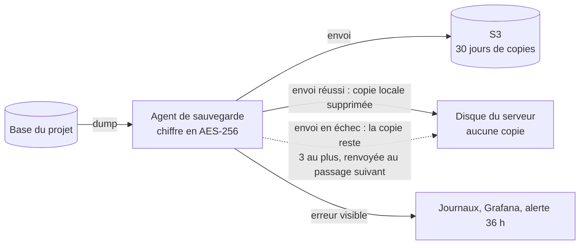

# Sauvegardes

> L'agent de sauvegarde, sa fréquence, et le test de restauration mensuel. Pas à pas : [guide 4](../../guides/04-sauvegardes-mega-s4.md) et [agent `db-backup`](../../images/db-backup/README.md).
> Retour au [sommaire de la documentation](../README.md).


## Le principe : les sauvegardes vivent sur S3, jamais sur le serveur

Toutes les copies de tous les projets se partageraient **le même disque** que les sites. Un disque qui se remplit **sans que personne ne le voie** les
fait tomber **tous**. Et une copie gardée sur le serveur ne protège pas d'un sinistre du serveur. La règle est donc : **la copie part sur S3, puis elle est supprimée du serveur.**



| Situation | Ce que fait l'agent | Effet sur le disque |
| --- | --- | --- |
| **Cas normal** : S3 répond | Dump, chiffrement, envoi, **suppression de la copie locale** | Rien ne s'accumule |
| **S3 injoignable** | Garde la copie chiffrée (c'est peut-être la seule), **sort en erreur**, la renvoie au prochain passage | **Trois copies au plus** : le disque est borné par construction |
| **S3 revient** | Envoie la nouvelle copie **et** celles en attente, puis les supprime | Retour à zéro |
| **Pas de S3 configuré** | **Refuse** de sauvegarder (sortie en erreur) : pas de sauvegarde « locale seulement » par défaut | Rien d'écrit |
| **Environnement volontairement non sauvegardé** (un staging jetable) | `BACKUP_DISABLED=1` : ne fait rien, le dit | Rien d'écrit |
| **Exception explicite** `BACKUP_LOCAL_KEEP=N` | Garde aussi N copies après l'envoi | N copies : **à n'utiliser que sciemment** |

### Les quatre garde-fous qui empêchent « de saturer sans le savoir »

| # | Garde-fou | Où |
| --- | --- | --- |
| 1 | **Par construction** : aucune copie ne reste après un envoi réussi ; au plus trois si l'envoi échoue | agent `db-backup` |
| 2 | **Une sauvegarde en échec est bruyante** : sortie en erreur, ligne dans les journaux, visible dans Grafana (et, pour un projet en `BACKUP_BEFORE_DEPLOY=always`, la promotion est refusée) | agent, `deploy.sh` |
| 3 | **Alerte « Aucune sauvegarde envoyée hors du serveur depuis 36 heures »** (journaux de l'agent) ; contrôle de santé du conteneur sur le même critère. **L'alerte est globale, pas par projet** : voir « Limite connue » ci-dessous | Grafana, `docker ps` |
| 4 | **Alerte disque** (« / » à plus de 85 %) pour tout ce qui ne serait pas dans ce cadre | Grafana |

### Le contrôle de santé

Le conteneur de sauvegarde est `healthy` si **un envoi a réussi il y a moins de 36 heures** (marqueur `/backups/.last-upload`, quelques octets). Ce n'est plus
« un fichier existe » : il n'y en a plus.

### Limite connue de l'alerte (constat du 2026-10-05)

L'alerte ne sonne que si **plus aucun** agent de production n'envoie quoi que ce soit : `absent_over_time` porte sur **l'ensemble** des agents. Tant qu'**un seul** projet envoie ses copies,
elle reste silencieuse, **même si un autre projet n'est plus sauvegardé du tout**. Exemple réel : le pilote envoie ses copies sur S3 ; le Core de production a son agent désactivé
(`BACKUP_DISABLED=1`, faute de bucket) : l'alerte ne dit rien du Core.

Ce qui détecte l'absence de sauvegarde **projet par projet**, aujourd'hui : l'état de santé du conteneur `backup` (`docker ps` : `healthy`, voir ci-dessus) et `bin/vps-audit.sh`. Une règle par projet
(« un agent de production qui journalise mais n'a envoyé aucune copie depuis 36 h ») est possible ; elle n'est pas en place, parce qu'elle sonnerait en permanence pour un projet **volontairement** sans sauvegarde.

## L'agent

L'agent [`images/db-backup`](../../images/db-backup/README.md) tourne dans chaque projet qui a une base de données :
- dump chaque nuit, chiffré AES-256 avec une phrase de passe propre au projet ;
- copie sur S3 (MEGA S4, R2, B2…), **gardée 30 jours** (réglable), puis effacée du serveur ;
- chaque projet et **chaque production** a son propre dossier sur S3 (`BACKUP_NAME`).

## Quand une sauvegarde est-elle faite ?

| Quand | Comment | Qui |
| --- | --- | --- |
| **Chaque nuit**, à l'heure du projet (`BACKUP_TIME`) | Automatique : c'est **le filet** | l'agent |
| **À la demande**, par exemple avant une migration risquée | `deploy.sh backup [env]` (envoyée sur S3 comme la nocturne) | la personne qui déploie |
| **Avant chaque déploiement** | **Non, par défaut.** Un projet qui préfère la prudence met `BACKUP_BEFORE_DEPLOY=always` dans `platform.env` | `deploy.sh` |

**Pourquoi pas à chaque déploiement ?** Cela coûte une minute et du trafic à chaque changement, même quand la base n'est pas touchée. Et décider automatiquement « cette version
porte une migration » n'est pas fiable (chaque projet range ses migrations où il veut). Une règle simple et connue vaut mieux qu'une règle automatique qui se trompe.
Décision : [ADR-0067](../adr/0067-profils-de-projet-et-sauvegardes-sur-s3-seulement.md).

**Le risque accepté, dit clairement.** Si une migration ratée abîme les données, on ne revient qu'à la sauvegarde **de la nuit** : les écritures de la journée sont perdues.
Pour s'en protéger : prendre une sauvegarde à la main **avant** une migration risquée (`deploy.sh backup`), ou déployer juste après la nocturne. Un déploiement qui ne touche pas la base
n'a pas ce risque : revenir au code d'avant n'oblige à aucune restauration.

Selon le [profil du projet](profils-de-projet.md#7-les-sauvegardes-selon-le-profil) : un site simple n'en a pas, un staging peut la désactiver (`BACKUP_DISABLED=1`).

## Restaurer

**La restauration se fait depuis S3** : `restore.sh <env> s3://<bucket>/<préfixe>/<projet>-<env>/<fichier>`. Le runbook pas à pas, avec la table-témoin qui
prouve que la base est bien **remplacée** : [exercice de restauration](../runbooks/exercice-de-restauration.md).

**Test de restauration mensuel**, obligatoire pour qu'une sauvegarde compte : restaurer **directement depuis S3**, par exemple la production dans le staging.

```bash
cd /app/<projet>/staging
# La phrase de passe de PRODUCTION est donnée ponctuellement, jamais écrite dans .env.staging :
read -rs RESTORE_PASSPHRASE && export RESTORE_PASSPHRASE
/app/vps-platform/bin/restore.sh staging s3://<bucket>/<préfixe>/<projet>-prod/<fichier>
```

Cela restaure la production dans le staging. Attention aux données personnelles : le staging contient alors des données réelles. Le réinitialiser ensuite si besoin.
