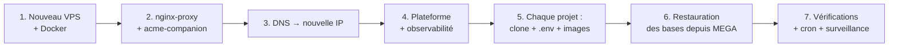

# 12. Reprise après sinistre : le serveur est perdu

Le VPS a disparu : panne définitive, piratage, suppression par erreur. Objectif :
tout remettre en ligne sur un serveur neuf, **avec les données de la dernière
sauvegarde**. Durée visée : 2 à 4 heures.



## À préparer AVANT le sinistre (sinon ce guide ne marche pas)

Hors du serveur, dans le gestionnaire de mots de passe de l'entreprise ou un coffre
partagé :

| Élément | Pourquoi |
| --- | --- |
| Le `docker-compose.yml` de nginx-proxy (`/app/nginx-proxy-conf`) | pour reconstruire la porte d'entrée à l'identique |
| Les `.env` de **chaque** projet (prod et staging) | `APP_KEY`, mots de passe… : sans eux, les données chiffrées en base sont illisibles |
| Les **phrases de passe des sauvegardes** (`BACKUP_PASSPHRASE`) | sans elles, les sauvegardes MEGA sont illisibles |
| Les accès MEGA S4, registrar ou Cloudflare, GitLab | pour tout récupérer et repointer le DNS |
| Le registre des sous-domaines (`vps-hosts.sh --csv`, guide 1) | pour savoir quoi remettre en ligne |

**Vérifier chaque trimestre que ces éléments sont à jour.** Un `.env` modifié sur le
serveur mais pas dans le coffre est un piège.

## Étape 1 — Nouveau serveur

```bash
$ curl -fsSL https://get.docker.com | sh            # Docker + Compose
$ apt install -y git jq curl ufw unattended-upgrades fail2ban
$ ufw allow 22 && ufw allow 80 && ufw allow 443 && ufw enable
$ mkdir -p /app
```

## Étape 2 — La porte d'entrée

```bash
$ docker network create nginx-proxy
$ mkdir -p /app/nginx-proxy-conf && cd /app/nginx-proxy-conf
# recopier le docker-compose.yml (et nginx-proxy/custom/…) depuis le coffre
$ docker compose up -d
```

## Étape 3 — DNS

Chez le registrar ou chez Cloudflare : remplacer l'ancienne IP par la nouvelle, sur
**chaque** enregistrement `A`/`AAAA` qui pointait vers l'ancien serveur, wildcard
`*` compris. La propagation prend de quelques minutes jusqu'au TTL.

## Étape 4 — Plateforme

Suivre le guide 3 (clone, réseau `observability`, `.env`, démarrage). L'historique
de l'observabilité est perdu ; ce n'est pas grave.

## Étape 5 — Chaque projet

```bash
$ mkdir -p /app/<projet> && cd /app/<projet>
$ git clone <dépôt> staging && git clone <dépôt> prod
# recopier .env (prod) et .env.staging (staging) depuis le coffre
$ cd staging && /app/vps-platform/infra/bin/deploy.sh build origin/main
```

Noter le SHA affiché. C'est le dernier commit de `main`, normalement celui qui
était en production. En cas de doute, comparer avec `history` dans
`/var/lib/vps-platform` (perdu avec le serveur) ou avec le journal GitLab.

## Étape 6 — Restaurer les données

Pour chaque projet avec une base, **avant** la première promotion :

```bash
$ cd /app/<projet>/prod
$ docker compose -p <projet>-prod -f compose.prod.yaml --env-file .env up -d <service-base> backup
$ docker compose -p <projet>-prod -f compose.prod.yaml --env-file .env run --rm backup \
    sh -c 'aws ${BACKUP_S3_ENDPOINT:+--endpoint-url $BACKUP_S3_ENDPOINT} s3 ls s3://$BACKUP_S3_BUCKET/$BACKUP_S3_PREFIX/$BACKUP_NAME/ | tail -5'
#   → choisir la plus récente
$ /app/vps-platform/infra/bin/restore.sh prod s3://<bucket>/backups/<nom>/<fichier>.dump.enc
$ SKIP_BACKUP=1 /app/vps-platform/infra/bin/deploy.sh up prod <sha de l'étape 5>
```

`deploy.sh up prod` démarre l'application sur les données restaurées et applique
les éventuelles migrations manquantes. `SKIP_BACKUP=1` évite une sauvegarde inutile
juste après une restauration.

## Étape 7 — Vérifier et rebrancher

```bash
$ /app/vps-platform/infra/bin/vps-hosts.sh         # tous les noms attendus, aucune collision
$ /app/vps-platform/infra/bin/vps-audit.sh         # aucune ligne CRITIQUE
$ curl -fsS https://<chaque site>/<route de santé>
```

Ensuite :
- remettre les lignes cron du staging automatique (guide 7) ;
- vérifier que la surveillance externe est revenue au vert (guide 8) ;
- appliquer le réglage des journaux Docker (guide 9) ;
- les fournisseurs qui filtrent par IP (MyCoolPay, WAHA…) : leur communiquer la
  **nouvelle IP** du serveur si nécessaire.

## S'entraîner

Une fois par an, refaire ce guide sur un petit VPS temporaire, avec un seul projet.
C'est la seule façon de savoir s'il marche, et combien de temps il faut vraiment.
