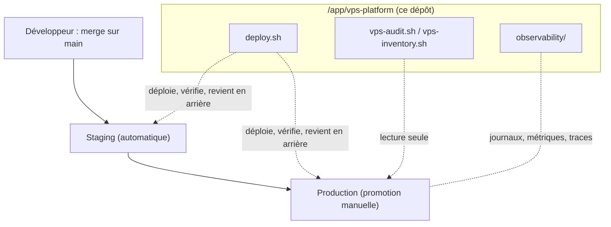

# 15. Prise en main par une nouvelle équipe informatique

Ce guide s'adresse à une personne ou une équipe qui **reprend le serveur** sans avoir
assisté à sa mise en place. À la fin, vous savez : où tout se trouve, ce qui fait foi,
comment un projet est déployé, comment **faire évoluer la plateforme** sans la casser, et
quoi lire en cas d'incident.

| Risque pour les sites | Durée de lecture |
| --- | --- |
| Aucun : ce guide ne demande aucune action sur le serveur | 30 minutes, puis les liens au fil des besoins |

## 1. Le modèle en une page

Le serveur est un seul VPS, organisé en **trois couches**. Chacune a un rôle et un
propriétaire différents.

| Couche | Ce que c'est | Où | Qui la change |
| --- | --- | --- | --- |
| **L'hôte** | Le système, Docker, le pare-feu, SSH, la rotation des journaux, le swap | le serveur lui-même ([réglages de l'hôte](../docs/reference/reglages-de-lhote.md), [guide 9](09-rotation-journaux-hote.md)) | l'administrateur du serveur |
| **La plateforme** | `nginx-proxy` (HTTPS et routage), les outils `deploy.sh`, `vps-audit.sh`, `vps-inventory.sh`, `restore.sh`, l'observabilité (Grafana et ses services) | ce dépôt, cloné dans `/app/vps-platform` | le responsable de la plateforme, par pull request |
| **Les projets** | Chaque application : son dépôt, son `compose.prod.yaml`, son `platform.env`, ses `.env` | `/app/<projet>/<env>` (un clone par environnement) | le responsable du projet |



**Une règle domine toutes les autres : le [contrat d'un projet](../docs/05-contrat-projet.md)
fait foi.** Les modèles (`templates/`), les outils (`bin/`) et les guides en découlent. En
cas de désaccord entre l'un d'eux et le contrat, c'est un défaut à corriger, pas un cas à
contourner.

## 2. Que lire, dans quel ordre

| Ordre | Document | Pourquoi |
| --- | --- | --- |
| 1 | [README](../README.md), § 1 et 2 | Les réseaux, et les 16 règles |
| 2 | [Contrat d'un projet](../docs/05-contrat-projet.md) | La référence : clauses C1 à C14, noms, mise en conformité (§ 4), évolution du contrat (§ 5) |
| 3 | [Glossaire](../docs/03-glossaire.md) et [schémas](../docs/01-schemas.md) | Le vocabulaire et les éléments |
| 4 | [Retours d'expérience](../docs/retours-experience/README.md) | Ce qui a déjà mal tourné, et ce qui l'empêche maintenant |
| 5 | [Runbooks d'incident](../docs/runbooks/README.md) | Quoi faire quand quelque chose tombe |
| 6 | [Inventaires](../docs/inventaire/README.md) | L'état du serveur à une date donnée, et les écarts connus |
| 7 | [Mettre un projet au standard](16-mettre-un-projet-au-standard.md) | La procédure pour chaque projet |
| 8 | [Déployer selon la situation](../docs/reference/deployer-selon-la-situation.md) | **La page où arriver avec un problème** : chaque situation, la commande, qui, la coupure, le retour arrière |
| 9 | [Le pipeline GitLab](../docs/reference/pipeline-gitlab.md), [clones et droits](../docs/reference/clones-et-droits.md), [les branches](../docs/reference/branches-et-fusions.md), [modifier une valeur](../docs/reference/modifier-une-valeur.md) | Comment un projet arrive sur le serveur, à qui sont ses dossiers, ce qui se change comment |
| 10 | [Migrer une application en service](20-migrer-une-application-existante.md) | La bascule d'une ancienne installation, avec preuve de copie exacte et retour arrière |

## 3. Où se trouvent les choses sur le serveur

| Quoi | Où |
| --- | --- |
| Cette plateforme | `/app/vps-platform` (clone de ce dépôt). Les commandes courtes `vps-deploy`, `vps-audit`… (installées par `host/install-commands.sh`) évitent d'en taper le chemin ; `vps` (sans argument) dit comment on déploie, `vps where` où est la plateforme et quelle version |
| Un projet, un environnement | `/app/<projet>/<env>` (`env` = `staging` ou `prod`) |
| Configuration de déploiement d'un projet | `platform.env` à la racine de son dépôt (commité, **aucun secret**) |
| Secrets d'un projet | `.env` (prod) et `.env.staging`, **uniquement sur le serveur**, jamais commités |
| Version déployée, journal | `/var/lib/vps-platform/<projet>/<env>/` (`current`, `previous`) et `/var/lib/vps-platform/<projet>/deploy.log` |
| Pile d'observabilité | `/app/vps-platform/observability/` ; secrets dans `observability/.env` |
| Sauvegardes | **sur S3 seulement** : l'agent `db-backup` de chaque projet envoie la copie chiffrée et l'efface du serveur (son volume `backups` ne garde que le marqueur d'envoi) : [guide 4](04-sauvegardes-mega-s4.md), [Sauvegardes](../docs/reference/sauvegardes.md) |
| Projet Docker d'un environnement | `<projet>-<env>` (par exemple `skills-devops-prod`) |

Les noms suivent le [contrat, § 3](../docs/05-contrat-projet.md#3-les-noms) : connaître
`APP_NAME` suffit pour tout retrouver.

## 4. Comment un projet est déployé

| Étape | Commande, depuis `/app/<projet>/<env>` | Ce qui se passe |
| --- | --- | --- |
| Contrôle seul | `deploy.sh check <env>` | Vérifie l'accès git, la cohérence `platform.env` et compose, les noms sur les réseaux partagés. **Ne modifie rien.** Utilisable sur la production |
| Construire | `deploy.sh build [ref] [env]` | Image taguée par le commit |
| Déployer | `deploy.sh up <env> <sha>` | Contrôle, volumes, migrations, démarrage, santé ; retour automatique si la santé échoue |
| Staging automatique | `deploy.sh watch` (cron toutes les 2 minutes) | Déploie `main` en staging s'il a bougé |
| Production | `deploy.sh promote` | Promeut **exactement** l'image testée en staging, après une sauvegarde |
| Retour arrière | `deploy.sh rollback <env>` | Redéploie la version précédente |
| État | `deploy.sh status` | Version courante et précédente, conteneurs |

Deux garanties : on ne livre en production que ce que le staging a validé, et une version
qui ne répond pas à son healthcheck ne reste jamais en ligne. Limite : **les migrations ne
sont pas annulées** par un retour arrière ([protocole de livraison](../docs/reference/organisation-et-livraison.md#protocole-de-livraison)) : les écrire de façon compatible avec
la version précédente.

## 5. Comment faire évoluer la plateforme

Toute modification de ce dépôt suit le [contrat, § 5](../docs/05-contrat-projet.md#5-faire-évoluer-le-contrat).
Une évolution n'est terminée que lorsque **ces six points** sont faits, dans le même ensemble
de commits :

1. **Comprendre** : un [retour d'expérience](../docs/retours-experience/README.md) (incident) ou
   une [ADR](../docs/adr) (décision sans incident).
2. **Rendre le défaut impossible ou visible** : un contrôle bloquant dans `deploy.sh` s'il est
   certain que le déploiement échouerait, sinon un constat dans `vps-audit.sh`.
3. **Le prouver** : un test dans `tests/` qui **reproduit** le défaut et montre qu'il est arrêté
   ([tests/README](../tests/README.md)).
4. **Les modèles** de `templates/` appliquent la nouvelle règle.
5. **Le contrat** (nouvelle clause, version) et la table des règles du README.
6. **Les projets existants** : `deploy.sh check` et `vps-audit.sh` sur chacun, écarts notés.

Le flux de travail :

```bash
$ git checkout -b <sujet-court>
# modifier, puis lancer sur un poste avec Docker (jamais sur le serveur de production) :
$ tests/run-all.sh <test concerné>          # ou tout : CORE_DIR=… tests/run-all.sh
$ git push -u origin <sujet-court>          # puis une pull request ; CI verte obligatoire
```

Après la fusion sur `main`, **le serveur reçoit la modification** par `git pull` dans
`/app/vps-platform` ([guide 11](11-depot-plateforme.md)), qui décrit aussi le retour arrière.
Jamais de push direct sur `main`, jamais de force-push.

**Un contrôle bloquant ne doit jamais bloquer un projet sain.** Chaque contrôle nouveau a un
test « le défaut est arrêté » **et** un test « le projet sain passe ».

## 6. Règles qui ne se discutent pas

- Ne jamais lancer `docker compose down -v`, `docker volume rm` ni `docker system prune -a
  --volumes` : ils détruisent les données.
- Ne jamais commiter un `.env`, une clé, un jeton.
- Ne jamais publier un port d'un conteneur (`ports:`) : Docker contourne le pare-feu. Tout passe
  par `nginx-proxy`.
- Ne jamais modifier `platform.env` sur le serveur : on le change par un commit.
- Ne jamais faire `git pull`, `merge` ni `commit` dans le clone d'un **projet** (`/app/<projet>/<env>`) : c'est `vps-deploy` qui le met à jour ; une commande en root dans ces dossiers se termine par la vérification des propriétaires ([clones et droits](../docs/reference/clones-et-droits.md)).
- Un `restart` ne relit pas un fichier d'environnement modifié : c'est `vps-deploy up <env> <version courante>` ([modifier une valeur](../docs/reference/modifier-une-valeur.md)).
- Valider avant de redémarrer le runner GitLab : `gitlab-runner verify`, jamais l'inverse (un `config.toml` invalide met **tous** les projets sans runner) ; le runner SSH du serveur ne prend **que** les jobs qui portent son tag ([runbook](../docs/runbooks/runner-gitlab-hors-service.md)).
- Ne jamais renommer `APP_NAME` ni un volume d'un projet en production (nouveaux volumes vides).
- Un refus de `deploy.sh` n'est pas un obstacle : il dit quoi corriger, et rien n'a été modifié.

## 7. Accès, secrets et dépôts

- Le serveur lit les dépôts par une **clé de déploiement SSH en lecture seule**, une par dépôt
  ([guide 3](03-installer-plateforme.md), étape 0). Un dépôt rendu public provisoirement est une
  exception temporaire : [guide 14](14-retour-aux-depots-prives.md) pour revenir au standard.
- Les secrets d'un projet ne vivent que dans ses `.env` sur le serveur. Ceux de la plateforme
  vivent dans `observability/.env` et dans la configuration des sauvegardes.

## 8. Rythme d'exploitation

| Quand | Quoi | Qui |
| --- | --- | --- |
| Chaque jour (automatique) | Surveillance externe, alertes, sauvegardes | — |
| Chaque semaine | `vps-audit.sh` : aucune ligne CRITIQUE | plateforme |
| Chaque mois | Restaurer une sauvegarde de production dans un staging ([sauvegardes](../docs/reference/sauvegardes.md)) | chaque projet |
| Chaque trimestre | Nouvel [inventaire](../docs/inventaire/README.md), comparé au précédent ; relecture du contrat | plateforme |
| À chaque incident | Un retour d'expérience, clos seulement quand un contrôle automatique empêche la récidive | tous |

## 9. Par où commencer le premier jour

1. Lire les documents de la section 2, dans l'ordre.
2. Sur un **poste de développement** : cloner ce dépôt, lancer `tests/run-all.sh hosts` pour
   voir un test réel tourner.
3. Sur le serveur, en **lecture seule** : `vps-inventory.sh` puis `vps-audit.sh`. Comparer
   avec le dernier fichier de `docs/inventaire/`.
4. Choisir un projet de démonstration, lancer `deploy.sh check` dans son dossier et lire la sortie.
5. Lire un [runbook](../docs/runbooks/README.md) et se demander : « saurais-je le faire à 3 h du matin ? »
