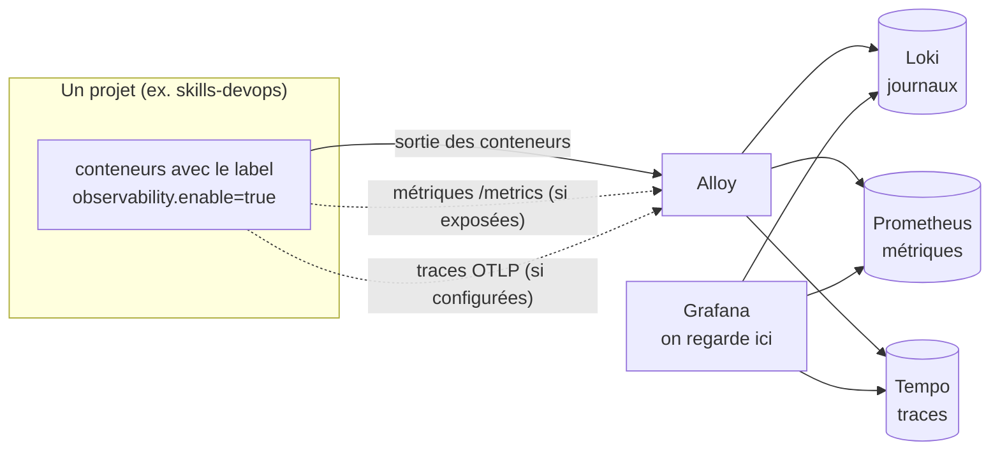

# 17. Comprendre l'observabilité et lire Grafana

Ce guide explique, **sans supposer de connaissance préalable**, à quoi sert chaque service
de la pile d'observabilité, ce qu'on peut voir dans Grafana, et comment le lire. Il complète
le [README de l'observabilité](../observability/README.md) (qui dit comment l'installer et
brancher un projet).

| Risque pour les sites | Durée de lecture |
| --- | --- |
| Aucun : on ne fait que regarder | 30 minutes, avec Grafana ouvert à côté |

## 1. L'idée en une phrase

**Quand une application tourne, elle laisse des traces de ce qu'elle fait. L'observabilité les
rassemble au même endroit pour qu'on puisse répondre à : « que s'est-il passé, quand, et
pourquoi ? »** — sans avoir à se connecter à chaque conteneur.

Image : la boîte noire et le tableau de bord d'une voiture. Le tableau de bord montre
l'état *maintenant* (vitesse, voyants). La boîte noire garde l'*historique* pour comprendre
après coup. Ici, la pile fait les deux, pour tous les projets du serveur à la fois.

## 2. Trois sortes de données (et pourquoi trois)

| Donnée | Elle répond à | Exemple | Où elle vit |
| --- | --- | --- | --- |
| **Journaux** (logs) | *Que s'est-il passé ?* Une ligne de texte par événement | `ERROR : connexion à la base refusée` | Loki |
| **Métriques** | *Combien ? À quelle vitesse ? Est-ce que ça va ?* Des nombres dans le temps | requêtes par seconde, mémoire, `up = 1` | Prometheus |
| **Traces** | *Où le temps est-il passé ?* Le trajet d'**une** requête à travers les composants | la requête a pris 2 s : 1,8 s dans la base | Tempo |

On a besoin des trois : un graphique de métriques montre **qu'il y a un problème** ; les
journaux disent **ce qui s'est passé** ; la trace dit **où**.

## 3. Le rôle de chaque service

La pile est installée **une seule fois** pour tout le serveur, dans son propre projet
Docker (`observability`). Cinq conteneurs, qui travaillent ensemble.

| Service | Analogie | Ce qu'il fait | Ce qu'il garde et combien de temps | Comment le voir |
| --- | --- | --- | --- | --- |
| **Alloy** | Le facteur | **Collecte** : lit la sortie des conteneurs qui ont demandé à être observés (label `observability.enable=true`), va chercher leurs métriques, reçoit leurs traces, puis **livre** tout aux trois magasins. Il ne conserve rien | presque rien (un point de reprise) | Pas d'interface utile : on voit son travail dans les autres |
| **Loki** | Le classeur des journaux | **Stocke** les lignes de journal et permet de les chercher par étiquette (`app`, `deployment`, `service`, `container`, `level`) ou par texte | 90 jours | Grafana → **Explore** → source **Loki** |
| **Prometheus** | Le compteur et la courbe | **Stocke** les métriques sous forme de séries de nombres horodatés et sait faire des calculs dessus | 15 à 30 jours (réglage) | Grafana → **Explore** → source **Prometheus** |
| **Tempo** | Le suivi de colis | **Stocke** les traces : le parcours complet d'une requête, avec la durée de chaque étape | 30 jours | Grafana → **Explore** → source **Tempo** (ou le lien `trace_id` depuis un journal) |
| **Grafana** | La salle de contrôle | **Affiche** : tableaux de bord, recherche, alertes. Il ne stocke pas les données (sauf ses comptes et réglages) : il interroge Loki, Prometheus et Tempo | ses comptes, tableaux, règles d'alerte | **Le seul qu'on ouvre** : `https://grafana.<domaine>` |

Règle à retenir : **Alloy collecte → Loki, Prometheus et Tempo stockent → Grafana montre.**
Si un projet n'apparaît pas dans Grafana, la question est toujours : *est-il collecté par
Alloy ?* (a-t-il le label ?).

**Rien n'est collecté sans consentement** : un conteneur sans le label est ignoré, même s'il
tourne sur le même serveur. C'est pourquoi un projet récent n'apparaît qu'une fois branché.

## 4. Se repérer dans Grafana

Menu de gauche :

| Entrée | À quoi ça sert | Quand l'utiliser |
| --- | --- | --- |
| **Dashboards** | Les tableaux de bord prêts à l'emploi, rangés en dossiers (**Applications**, **Core System**) | Vue d'ensemble, surveillance de routine |
| **Explore** | La recherche libre dans une source (Loki, Prometheus ou Tempo) | Enquêter sur un problème précis |
| **Alerting** | Les règles d'alerte, leur état, les contacts, les mises en sourdine | Savoir si quelque chose cloche, régler les notifications |
| **Connections → Data sources** | Les trois sources déjà configurées | Rarement : tout est préconfiguré |
| Profil (en bas) | Changer son mot de passe | Une fois, à la première connexion |

## 5. Premiers pas : six exercices guidés

À faire dans l'ordre, avec un projet branché (par exemple `skills-devops`).

**1. Voir quelles applications envoient des journaux.**
*Dashboards → Applications → « Applications — journaux (tous projets) ».* Le panneau
**« Applications qui envoient des journaux »** liste les projets branchés. S'il est vide, aucun
projet n'est branché (ou l'intervalle de temps en haut à droite est trop court : choisir
« Last 6 hours »).

**2. Lire le tableau.** En haut, quatre filtres : **Application**, **Déploiement**
(`prod` ou `staging`), **Service** (le conteneur : `web`, `worker`…) et **Recherche** (texte
libre ou un `correlation_id`). Cinq panneaux : *volume de journaux par niveau*,
*nombre d'erreurs*, *nombre d'avertissements*, *applications qui envoient des journaux*, puis
la liste des **journaux**. Choisir une application et un déploiement ; regarder si les barres
d'erreurs montent.

**3. Chercher dans les journaux (Explore).** *Explore → source Loki → onglet « Code »*, puis :

| Je veux | Requête (LogQL) |
| --- | --- |
| Tous les journaux d'un projet en production | `{app="skills-devops", deployment="prod"}` |
| D'un seul conteneur | `{app="skills-devops", service="web"}` |
| Les lignes contenant « error » | `{app="skills-devops"} \|= "error"` |
| Sans le bruit des contrôles de santé | `{app="skills-devops"} != "/up"` |
| Les erreurs au format JSON | `{app="skills-devops"} \| json \| level_name="ERROR"` |
| Combien de lignes par minute | `sum(count_over_time({app="skills-devops"}[1m]))` |

Les étiquettes disponibles sont `app`, `deployment`, `service`, `container` et `level` (le niveau du journal, tiré de `level_name` quand l'application écrit en JSON). Bouton
**Run query** en haut à droite ; le sélecteur de temps (en haut) borne la recherche.

**4. Retrouver ce qui s'est passé pendant un déploiement.** Régler l'intervalle autour de
l'heure indiquée par `deploy.sh status` (ou le journal de déploiement), prendre
`{app="…", deployment="prod"}` et chercher `|= "migrat"` ou `|= "ERROR"`.

**5. Suivre une requête de bout en bout.** Une ligne de journal peut contenir un
`correlation_id` et un `trace_id`. Copier le `correlation_id` dans le filtre **Recherche** du
tableau : toutes les lignes de cette requête apparaissent, dans tous les services. Un lien
**Tempo** à côté d'un `trace_id` ouvre la trace correspondante (la source Loki le prévoit).

**6. Les métriques (quand elles existent).** *Explore → source Prometheus*, requête
`up{app="mon-projet"}` : **1** si Alloy arrive à lire les métriques du projet, **0** sinon. Un
projet qui n'expose pas `/metrics` n'apparaît pas ici : c'est normal, il n'a que des journaux.

## 6. Lire les alertes

*Alerting → Alert rules.* Chaque règle a un **état** :

| État | Sens | Que faire |
| --- | --- | --- |
| **Normal** | Tout va bien | Rien |
| **Pending** | La condition est vraie, mais pas encore depuis assez longtemps (le délai « for ») | Surveiller |
| **Firing / Alerting** | Le problème est confirmé : une notification part | Enquêter (journaux, tableau) |
| **No data** | La règle ne reçoit aucune donnée | Souvent : le projet n'est pas branché. Vérifier l'étape 1 |
| **Error** | La règle n'a pas pu s'évaluer | Journal de Grafana |

Notifications : *Alerting → Contact points* (où part l'alerte : e-mail, etc.), bouton **Test**
pour vérifier. Pour **faire taire une alerte un moment** sans la supprimer : *Alerting →
Silences → New silence*, avec une durée et un filtre sur le nom de la règle.

> **Piège connu.** Les six règles fournies (`Core injoignable`, `Relais outbox bloqué`,
> `Nouvelles livraisons webhook en DLQ`, `Taux d'erreurs 5xx élevé`, `Callbacks provider
> rejetés`, `File Horizon en retard`) sont **propres au Core**. Si le Core n'est pas branché, elles
> passent en « No data » et alertent à tort : c'est un faux positif, pas une panne. Brancher le
> Core ou mettre ces règles en silence en attendant.

## 7. Ce qu'il faut regarder, et quand

| Quand | Où | Ce qu'on cherche |
| --- | --- | --- |
| Chaque jour, 2 minutes | Tableau **Applications**, période « 24 h » | Les barres d'**erreurs** et d'**avertissements** montent-elles ? Un projet s'est-il tu (plus de journaux) ? |
| Après chaque déploiement | Explore Loki, `{app="…", deployment="prod"}` | Des erreurs depuis l'heure du déploiement ? |
| Quand un utilisateur signale un problème | Filtre **Recherche** (son identifiant ou le `correlation_id`) | La requête fautive et son erreur |
| Chaque semaine | *Alerting → Alert rules* | Aucune règle bloquée en « Firing » ou « Error » |
| Chaque trimestre | Cette pile elle-même | Espace des volumes, mises à jour des images, rétention |

**Signaux d'alarme** : un projet qui n'envoie plus de journaux alors qu'il tourne ; un pic
d'erreurs juste après un déploiement ; une règle en « Error » ; Grafana qui ne répond plus.

## 8. Scénario : « le site est lent »

1. **Métriques** (si le projet en expose) : le temps de réponse a-t-il augmenté ? depuis quand ?
2. **Journaux** autour de cette heure : `{app="…", deployment="prod"} |= "ERROR"`. Y a-t-il des
   erreurs de base de données, de timeout, de mémoire ?
3. **Trace** d'une requête lente : où passe le temps (base, appel externe, calcul) ?
4. **Serveur** : `docker stats --no-stream`, `df -h`, runbooks d'incident
   ([site en panne](../docs/runbooks/site-en-panne.md), [disque plein](../docs/runbooks/disque-plein.md)).

## 9. Ce que cette pile ne fait pas

- Elle **n'observe pas l'hôte** (processeur, disque, mémoire du serveur) : il n'y a pas de
  collecteur de métriques du système dans la pile. Pour cela : `df`, `free`, `docker stats`, ou
  l'ajouter plus tard (voir le plan d'infrastructure).
- Elle **ne prévient pas si le serveur tombe** : Grafana tourne sur ce serveur. La
  [surveillance externe](08-surveillance-externe.md) est indispensable.
- Elle **ne collecte que les projets qui l'ont demandé** : un projet sans label est invisible.
- Les **alertes fournies** ne couvrent que le Core ; il faut en écrire pour les autres projets
  (conteneur qui redémarre en boucle, disque, mémoire).

## 10. Mini-glossaire

| Mot | Sens |
| --- | --- |
| **Étiquette (label)** | Un couple nom=valeur attaché à une donnée : `app="skills-devops"`. Sert à filtrer |
| **LogQL / PromQL** | Les langages de requête de Loki (journaux) et de Prometheus (métriques) |
| **Scrape** | Prometheus (via Alloy) vient lire `/metrics` d'un projet à intervalle régulier |
| **OTLP** | Le protocole standard par lequel une application envoie ses traces à Alloy |
| **Rétention** | Combien de temps une donnée est gardée avant d'être effacée |
| **correlation_id / trace_id** | Identifiants qui relient toutes les lignes ou tous les morceaux d'une même requête |
| **Datasource** | Une source de données déclarée dans Grafana (Loki, Tempo, Prometheus) |
| **Silence** | Mise en sourdine temporaire d'une alerte, sans la supprimer |
