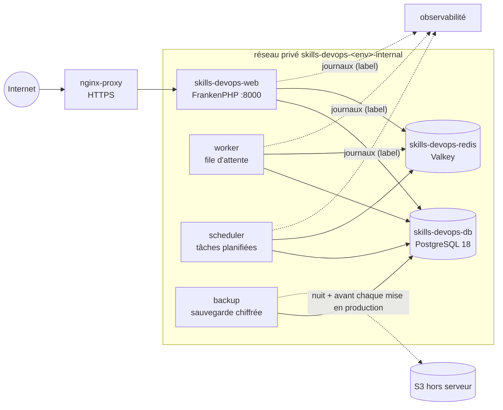
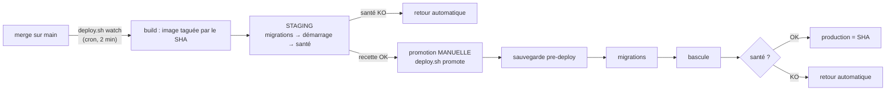

# 18. Le projet pilote `skills-devops` : étude de cas

`skills-devops` est le **premier projet entièrement au standard** de ce serveur. Il sert de **référence** : quand on
se demande « comment un projet doit-il être fait ? », on ouvre celui-ci et on regarde. Ce guide le décrit fichier par
fichier, relie chaque clause du [contrat](../docs/05-contrat-projet.md) à ce qu'il fait réellement, et dit **comment
intervenir** quand quelque chose ne va pas.

| Risque pour les sites | Durée de lecture |
| --- | --- |
| Aucun : on ne fait que lire | 30 minutes, avec le dépôt du projet ouvert à côté |

> **Un pilote n'est pas un modèle parfait.** Il montre ce qui marche et ce qui a mal tourné. La section 10 liste, sans
> les cacher, ce qui n'est pas encore au niveau qu'on voudrait.

## 1. En deux minutes

| Question | Réponse |
| --- | --- |
| C'est quoi ? | Une petite application Laravel (« Carnet DevOps ») dont le seul but est de **prouver la plateforme** : une page de statut, un compteur de visites en base, une file d'attente, un planificateur |
| Pourquoi elle est utile | Elle exerce **tout** : HTTPS, base de données persistante, cache, file, tâches planifiées, sauvegarde, journaux dans Grafana, déploiement avec retour arrière |
| Technologie | Laravel 13, FrankenPHP (PHP 8.4), PostgreSQL 18, Valkey (compatible Redis) |
| Environnements | `staging` (déployé automatiquement) et `prod` (promotion manuelle de **la même image**) |
| Où | `/app/skills-devops/staging` et `/app/skills-devops/prod`, projets Docker `skills-devops-staging` et `skills-devops-prod` |
| Ce qu'il ne montre pas | Une base MySQL/MariaDB (la majorité du serveur : voir la [variante](#9-adapter-ce-projet-à-un-autre)), un frontend statique, une application multi-domaines |

## 2. Les six services



| Service | Rôle | Visible depuis Internet ? |
| --- | --- | --- |
| `skills-devops-web` | Sert le site ; **seul** service branché sur `nginx-proxy` | oui, par `nginx-proxy` seulement |
| `worker` | Exécute les jobs de la file | non |
| `scheduler` | Lance les tâches planifiées chaque minute | non |
| `skills-devops-db` | PostgreSQL, données dans un volume | non, jamais |
| `skills-devops-redis` | Cache, sessions, file d'attente | non |
| `backup` | Sauvegarde chiffrée chaque nuit et avant chaque mise en production | non |

## 3. Anatomie du dépôt : chaque fichier a un rôle

| Fichier | Commité ? | Ce qu'il fait | À copier pour un autre projet ? |
| --- | --- | --- | --- |
| `compose.prod.yaml` | oui | **La pile**, identique pour staging et production | oui, c'est le cœur (partir de [`templates/`](../templates)) |
| `platform.env` | oui | Dit à `deploy.sh` comment déployer : nom, service de santé, migrations, sauvegarde. **Aucun secret** | oui, en changeant les noms |
| `Dockerfile` | oui | Construit l'image (la même pour tous les environnements) | adapter à la techno |
| `docker/entrypoint.sh` | oui | Met la configuration en cache au démarrage ; laisse passer les commandes ponctuelles (migrations) | propre à Laravel |
| `.env.production.example`, `.env.staging.example` | oui | La **liste des variables**, sans valeur secrète | oui |
| `.env` (prod), `.env.staging` | **jamais** | Les secrets, **uniquement sur le serveur**, mode `600` | non, on les crée sur le serveur |

Les noms de variables à renseigner sont dans les fichiers `.example` ; les valeurs n'apparaissent **jamais** dans le dépôt.

## 4. Le contrat, clause par clause, avec le pilote

| Clause | Ce que fait le pilote | Où le voir |
| --- | --- | --- |
| **C1** Tout passe par `nginx-proxy` | Aucun `ports:`. Seul le web porte `VIRTUAL_HOST`, `VIRTUAL_PORT`, `LETSENCRYPT_HOST` | `compose.prod.yaml`, service `skills-devops-web` |
| **C2** Base et cache en réseau privé | `skills-devops-db` et `skills-devops-redis` ne sont que sur le réseau `skills-devops-<env>-internal` ; seul le web rejoint aussi `nginx-proxy` | `networks:` de chaque service |
| **C3** Noms propres au projet | `skills-devops-web`, `-db`, `-redis` (les trois qui comptent : ce sont les noms qu'un autre projet pourrait confondre). Voir la note ci-dessous pour `worker`, `scheduler`, `backup` | `compose.prod.yaml`, `DB_HOST` et `REDIS_HOST` imposés dans `x-app` |
| **C4** Healthchecks | Web : `wget /up` ; base : `pg_isready -h 127.0.0.1` (**par le réseau**, pas par le socket) ; Redis : `valkey-cli ping` | `healthcheck:` |
| **C5** `platform.env` cohérent | `HEALTH_SERVICE`, `MIGRATE_SERVICE`, `DB_SERVICE` nomment des services qui existent dans le compose du **même commit** | `platform.env` |
| **C6** `platform.env` jamais modifié sur le serveur | Toute modification passe par un commit | `git status` propre sur le serveur |
| **C7** Images taguées par commit | `image: skills-devops:${IMAGE_TAG:-latest}`, `deploy.sh` pose le SHA | `compose.prod.yaml`, `x-app` |
| **C8** Redémarrage, mémoire, journaux | `restart: unless-stopped`, limite mémoire sur **chaque** service, rotation `max-size: 20m`, `max-file: 5` | `x-defaults`, `deploy.resources` |
| **C9** Accès git par clé de déploiement | **Exception temporaire** : dépôt public lu en HTTPS (voir section 10) | `git remote -v` sur le serveur |
| **C10** Secrets séparés | `.env` et `.env.staging` distincts, ignorés par git, mode `600` | `.gitignore`, `ls -l` sur le serveur |
| **C11** Sauvegarde chiffrée hors serveur | Service `backup` : chaque nuit à 03:15 UTC et avant chaque promotion, copie sur S3, restauration par exercice | [Sauvegardes](../docs/reference/sauvegardes.md), [exercice](../docs/runbooks/exercice-de-restauration.md) |
| **C12** Labels d'observabilité | `observability.enable`, `.app`, `.deployment` sur web, worker et scheduler | `x-app`, `labels:` |

**Note sur les noms `worker`, `scheduler`, `backup`.** Ils restent courts, comme dans les modèles. Cela ne pose aucun
problème **tant qu'ils ne sont que sur le réseau privé du projet** : le contrôle de `deploy.sh` ne bloque que les noms
publiés sur un **réseau partagé** (`nginx-proxy`, `observability`). **Piège** : le jour où l'un d'eux rejoint un réseau
partagé (par exemple `worker` sur `observability` pour exposer des métriques), il faut le préfixer (`skills-devops-worker`).

## 5. Du commit à la production



| Étape | Commande, depuis `/app/skills-devops/<env>` | Ce qui se passe |
| --- | --- | --- |
| Vérifier sans rien changer | `deploy.sh check <env>` | Accès git, cohérence `platform.env` et compose, noms sur les réseaux partagés |
| Construire | `deploy.sh build origin/main staging` | Image `skills-devops:<sha>`, aucun conteneur touché |
| Déployer en staging | `deploy.sh up staging <sha>` ou `deploy.sh watch` | Contrôle, migrations, démarrage, santé, retour automatique si échec |
| Promouvoir en production | `deploy.sh promote` | **La même image** que staging, après une sauvegarde `pre-deploy-*` |
| Revenir en arrière | `deploy.sh rollback <env>` | Redéploie la version précédente (les migrations ne sont **pas** annulées) |
| État | `deploy.sh status` | Version courante et précédente, conteneurs |

Le journal de chaque déploiement : `/var/lib/vps-platform/skills-devops/deploy.log`. **Le relire après une promotion** : une
ligne `ERREUR` après `OK` est un défaut à comprendre (voir le [retour d'expérience](../docs/retours-experience/2026-10-05-nettoyage-des-images-ne-fonctionnait-pas.md)).

## 6. Observabilité : ce que le pilote envoie à Grafana

| Donnée | Aujourd'hui | Pour l'obtenir dans un autre projet |
| --- | --- | --- |
| **Journaux** | Collectés par les labels `observability.*` (web, worker, scheduler) | Poser les trois labels sur chaque service à observer |
| **Niveau des journaux** (`level`) | Dépend du format : en texte brut, l'étiquette `level` est **vide** et les panneaux « Erreurs » et « Avertissements » restent à zéro | Écrire en **JSON** sur la sortie standard (`LOG_CHANNEL=stdout_json`), [README de l'observabilité](../observability/README.md) |
| **Métriques** | Aucune pour l'application | Exposer `/metrics`, ajouter `observability.metrics.port` et le réseau `observability` au web |
| **Traces** | Aucune | Variables `OTEL_*` vers `http://observability-alloy:4318` |
| **Alertes** | Aucune propre au projet | Règles dans Grafana ; [guide 17](17-comprendre-et-lire-grafana.md) |

**Règle de sécurité** : ne jamais mettre la base, Redis ni un conteneur PHP-FPM sur le réseau `observability`.

## 7. Sauvegarde et restauration

- Le service `backup` fait un `pg_dump` chiffré (AES-256) chaque nuit et **avant chaque promotion** (`pre-deploy-*`), le garde
  7 fois sur le serveur, et le **copie sur S3** si `BACKUP_S3_*` est renseigné.
- La phrase de chiffrement (`BACKUP_PASSPHRASE`) n'existe que dans le `.env` du serveur : **la conserver aussi hors du serveur**.
- **Une sauvegarde jamais restaurée n'est pas une sauvegarde** : l'[exercice de restauration](../docs/runbooks/exercice-de-restauration.md)
  se fait chaque mois. Le premier exercice du pilote a révélé que la restauration ne remplaçait pas réellement la base
  ([retour d'expérience](../docs/retours-experience/2026-10-05-la-restauration-ne-remplacait-pas-la-base.md)) : c'est exactement
  pour cela qu'on le fait.

## 8. Intervenir : où regarder, quoi faire

| Symptôme | Où regarder en premier | Runbook |
| --- | --- | --- |
| Le site ne répond plus | `deploy.sh status`, `docker ps -a`, journaux du web | [Site en panne](../docs/runbooks/site-en-panne.md) |
| Un déploiement échoue | `deploy.log`, puis `deploy.sh check <env>` | [Déploiement en échec](../docs/runbooks/deploiement-en-echec.md) |
| Un conteneur redémarre en boucle | `docker logs`, `docker inspect` (code de sortie) | [Conteneur en boucle](../docs/runbooks/conteneur-en-boucle.md) |
| La base ne répond pas | Journal de `skills-devops-db`, disque, mémoire | [Base inaccessible](../docs/runbooks/base-inaccessible.md) |
| Plus de place sur le disque | `df -h`, `docker system df` | [Disque plein](../docs/runbooks/disque-plein.md) |
| Erreur de certificat | Journal du companion, DNS | [Certificat non émis](../docs/runbooks/certificat-non-emis.md) |
| Vérifier qu'on saura restaurer | Exercice mensuel | [Exercice de restauration](../docs/runbooks/exercice-de-restauration.md) |
| Comprendre ce qui s'est passé | Grafana, tableau « Applications » | [Guide 17](17-comprendre-et-lire-grafana.md) |

Règle commune à toute intervention : **regarder avant de toucher**, un changement à la fois, jamais `down -v`.

## 9. Adapter ce projet à un autre

Pour un nouveau projet, on **ne part pas d'une page blanche** : on copie le modèle correspondant de [`templates/`](../templates), on
remplace le nom (`mon-saas` devient le nom du projet **partout**, noms de services compris) et on suit la
[fiche de conformité](16-mettre-un-projet-au-standard.md).

| À changer | Où |
| --- | --- |
| `APP_NAME`, noms des services, `DB_HOST`, `REDIS_HOST` | `platform.env`, `compose.prod.yaml` |
| Commande de démarrage, healthcheck de l'application | `compose.prod.yaml`, `platform.env` |
| Image et extensions | `Dockerfile` |
| Variables | `.env.*.example` (les valeurs réelles vont dans les `.env` du serveur) |

### Variante MySQL / MariaDB (la majorité du serveur)

Le pilote est en PostgreSQL ; la plupart des projets du serveur sont en **MariaDB 10.7**. Le principe est le même, trois blocs changent
(**à valider sur un premier projet réel avant de généraliser** : cette variante n'est pas exercée par le pilote) :

```yaml
  mon-saas-db:
    image: mariadb:11.4                 # ou mysql:8.4 ; version à choisir avec le responsable du projet
    environment:
      MARIADB_DATABASE: ${DB_DATABASE}
      MARIADB_USER: ${DB_USERNAME}
      MARIADB_PASSWORD: ${DB_PASSWORD}
      MARIADB_ROOT_PASSWORD: ${DB_ROOT_PASSWORD}
    volumes: [ db-data:/var/lib/mysql ]
    healthcheck:
      test: [ "CMD", "mariadb-admin", "ping", "-h", "127.0.0.1", "--silent" ]   # par le réseau (clause C4)

  backup:
    build:
      context: /app/vps-platform/images/db-backup
      args: { BASE: "mariadb:11.4" }    # client mariadb-dump / mariadb
    environment:
      BACKUP_ENGINE: mysql
      MYSQL_HOST: mon-saas-db
      MYSQL_DATABASE: ${DB_DATABASE}
      MYSQL_USER: ${DB_USERNAME}
      MYSQL_PASSWORD: ${DB_PASSWORD}
```

Côté `.env` : `DB_CONNECTION=mysql` (ou `mariadb`), `DB_HOST=mon-saas-db`, `DB_PORT=3306`. **Restauration** : mêmes commandes, mais elle n'est **pas
atomique** (le DDL de MySQL ne l'est pas) : le fichier chiffré reste disponible pour recommencer
([agent de sauvegarde](../images/db-backup/README.md)). L'agent est testé sur MySQL 8.4, MariaDB 10.7 et MariaDB 11.4.

## 10. Ce qui n'est pas encore au niveau (état au 2026-10-05)

Un pilote honnête dit ses écarts. Chacun a un responsable et une action dans le plan d'infrastructure.

| Écart | Clause | Conséquence | Action prévue |
| --- | --- | --- | --- |
| Dépôt **public** lu en HTTPS par le serveur | C9 | Exception temporaire, le temps des tests | Clé de déploiement ([guide 14](14-retour-aux-depots-prives.md)) ou migration de dépôt |
| Journaux en texte brut : pas de niveau dans Grafana | C12 | Panneaux d'erreurs vides | `stdout_json` |
| Pas de `/metrics` | C12 | Aucune métrique applicative, aucune alerte | Route protégée, labels de métriques |
| Le conteneur `backup` n'a ni healthcheck ni labels | C4, C12 | Une sauvegarde qui cesse de tourner passe inaperçue | Healthcheck sur l'âge de la dernière copie, labels |
| Staging déployé à la main (pas de `deploy.sh watch` en cron) | § 5 du README | « Merge sur main » ne déploie pas seul | Ligne cron de `root` |
| Bucket de sauvegarde partagé avec un autre projet | C10 | Une fuite de l'un expose l'autre | Bucket ou clé dédiés |
| Les sauvegardes ne sont copiées hors serveur qu'en **production** | C11 | Le staging n'a pas de copie | Variables S3 du staging |

## 11. Les leçons du pilote

Chaque incident du pilote a produit une protection pour **tous** les projets :

| Date | Leçon | Protection |
| --- | --- | --- |
| 2026-10-04 | Un nom de service générique (`db`) peut mener à la base d'un autre projet | Contrôle bloquant de `deploy.sh`, clause C3 ([retour d'expérience](../docs/retours-experience/2026-10-04-premier-deploiement-skills-devops.md)) |
| 2026-10-04 | 9 Mo de JavaScript non compressé font échouer Grafana sur une connexion lente | Compression propre à Grafana ([retour d'expérience](../docs/retours-experience/2026-10-04-grafana-sans-compression.md)) |
| 2026-10-05 | Le nettoyage des images ne marchait jamais sur la disposition réelle du serveur | Test « disposition réelle » ([retour d'expérience](../docs/retours-experience/2026-10-05-nettoyage-des-images-ne-fonctionnait-pas.md)) |
| 2026-10-05 | La restauration ne remplaçait pas la base | Remplacement réel, exercice mensuel ([retour d'expérience](../docs/retours-experience/2026-10-05-la-restauration-ne-remplacait-pas-la-base.md)) |
