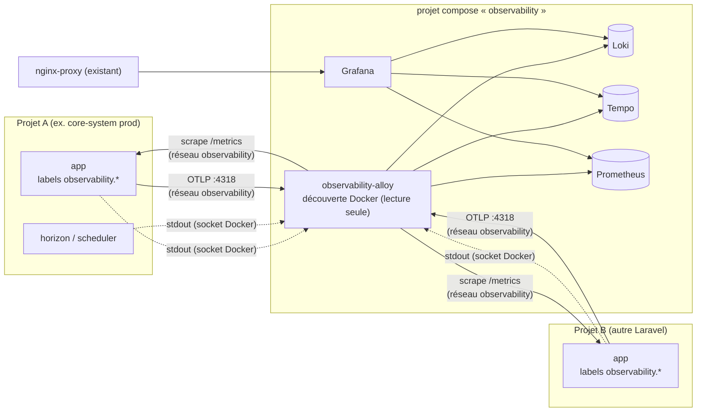

# Observabilité mutualisée du VPS

Une seule pile pour tous les projets du serveur, comme `nginx-proxy` :

- **Grafana** : l'interface, publiée via nginx-proxy sur `GRAFANA_HOST` ;
- **Loki** : les journaux ;
- **Tempo** : les traces ;
- **Prometheus** : les métriques ;
- **Alloy** : le seul collecteur, qui découvre les conteneurs par leurs labels Docker.

Décision : [ADR-0064](../../docs/adr/0064-infrastructure-vps-staging-observabilite-mutualisee.md).



**Rien n'est collecté sans consentement explicite** : un conteneur sans le label
`observability.enable=true` est ignoré, même s'il tourne sur le même serveur.

## Installation (une fois par serveur)

```bash
docker network create observability          # idempotent : ignorer « already exists »
cp infra/observability/.env.example infra/observability/.env   # puis le remplir
docker compose -f infra/observability/compose.yaml --env-file infra/observability/.env up -d
```

Aucune modification de nginx-proxy ni des autres projets : Grafana s'y déclare comme
n'importe quel site (`VIRTUAL_HOST` / `LETSENCRYPT_HOST`).

Ressources plafonnées : Loki 1 Go (`LOKI_MEMORY_LIMIT`), les quatre autres services
512 Mo chacun.

## Brancher un projet Laravel

### 1. Docker Compose du projet

Ajoutez le réseau `observability` et les labels **aux services à observer** :

```yaml
services:
  app:
    # …
    labels:
      observability.enable: "true"
      observability.app: "mon-saas"          # nom affiché dans Grafana
      observability.deployment: "prod"       # prod | staging | …
      observability.metrics.port: "8000"     # seulement si l'app expose /metrics
      # observability.metrics.path: "/metrics"   (défaut)
    networks: [default, observability]

  worker:
    # …
    labels:
      observability.enable: "true"
      observability.app: "mon-saas"
      observability.deployment: "prod"
    networks: [default, observability]

networks:
  observability:
    external: true
```

Les **journaux** sont lus par le socket Docker : le label suffit, aucun réseau
n'est requis (un conteneur sur plusieurs réseaux n'est collecté qu'une fois —
vérifié). Les **métriques** et les **traces** exigent le réseau `observability`.
Ne branchez jamais la base de données, Redis ni un conteneur **PHP-FPM** (FastCGI
sur le port 9000, sans authentification : quiconque le joint exécute du PHP) sur
ce réseau partagé : mettez-leur le label seul.

### 2. Journaux : JSON sur la sortie standard (aucune dépendance)

Dans `config/logging.php` :

```php
'stdout_json' => [
    'driver' => 'monolog',
    'handler' => Monolog\Handler\StreamHandler::class,
    'with' => ['stream' => 'php://stdout'],
    'formatter' => Monolog\Formatter\JsonFormatter::class,
    'level' => env('LOG_LEVEL', 'info'),
],
```

Puis `LOG_CHANNEL=stdout_json` dans le `.env` du projet.

Alloy lit le niveau (`level_name`) et en fait un label. Il conserve
`extra.correlation_id`, `extra.trace_id` et `extra.project_id` en métadonnées
cherchables. Une ligne non JSON passe telle quelle.

Pour retrouver une requête de bout en bout, ajoutez un identifiant de corrélation
dans `extra` (un processor Monolog qui lit `Context::get('correlation_id')`). C'est
exactement ce que fait le Core, voir `packages/support/src/Observability`.

### 3. Métriques (optionnel)

Exposez `/metrics` au format Prometheus. Par exemple avec un paquet comme
`spatie/laravel-prometheus`, ou une route maison sur le modèle de
`app/Http/Controllers/Observability/MetricsController.php`. Indiquez le port avec
`observability.metrics.port`.

Ne publiez pas `/metrics` sur Internet : refusez-le dans votre nginx, comme
`docker/nginx/prod/app.conf.template` le fait.

### 4. Traces (optionnel)

Envoyez l'OTLP/HTTP à `http://observability-alloy:4318`. Avec le SDK OpenTelemetry
PHP :

```dotenv
OTEL_SERVICE_NAME=mon-saas
OTEL_EXPORTER_OTLP_ENDPOINT=http://observability-alloy:4318
OTEL_EXPORTER_OTLP_PROTOCOL=http/json
```

### 5. Tableaux de bord

- **Applications → Applications — journaux (tous projets)** : filtres par
  application, déploiement et service, volume par niveau, recherche plein texte.
  Fonctionne pour tout projet branché, sans rien configurer.
- Un projet peut livrer ses propres tableaux de bord : déposez les JSON dans
  `grafana/dashboards/<Nom du projet>/`, puis redémarrez Grafana
  (`docker restart observability-grafana`). Ils apparaissent dans ce dossier.

## Vérifier qu'un projet est bien branché

```bash
docker exec observability-grafana wget -qO- http://loki:3100/loki/api/v1/label/app/values
# → la liste doit contenir la valeur de observability.app
```

Dans Grafana → Explore → Prometheus : `up{app="mon-saas"}` vaut `1` si le scrape
fonctionne.

## Rétention

| Donnée | Durée | Réglage |
| --- | --- | --- |
| Journaux | 90 jours | `loki/config.yaml` (`retention_period`) |
| Traces | 30 jours | `tempo/config.yaml` (`block_retention`) |
| Métriques | 30 jours | `PROMETHEUS_RETENTION` |
